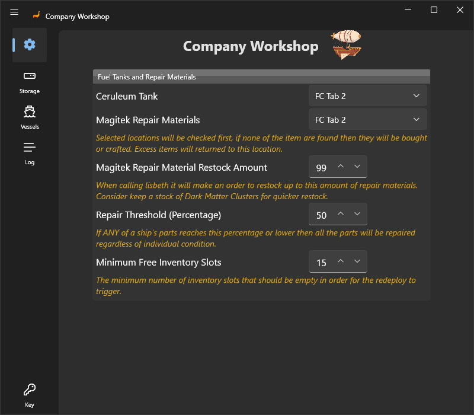
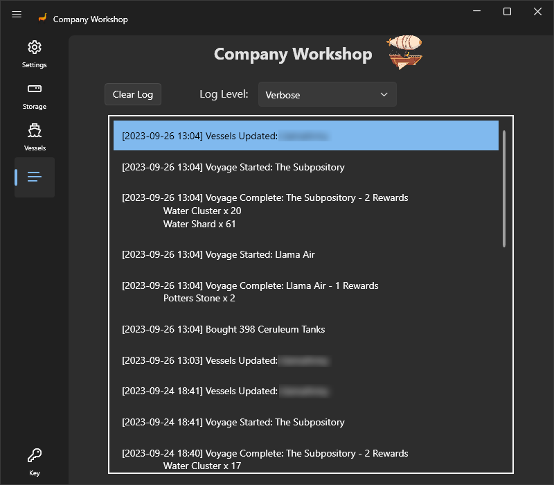
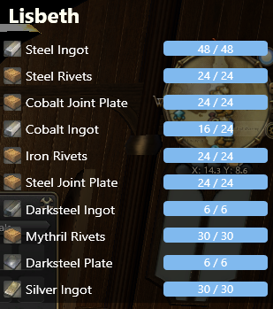
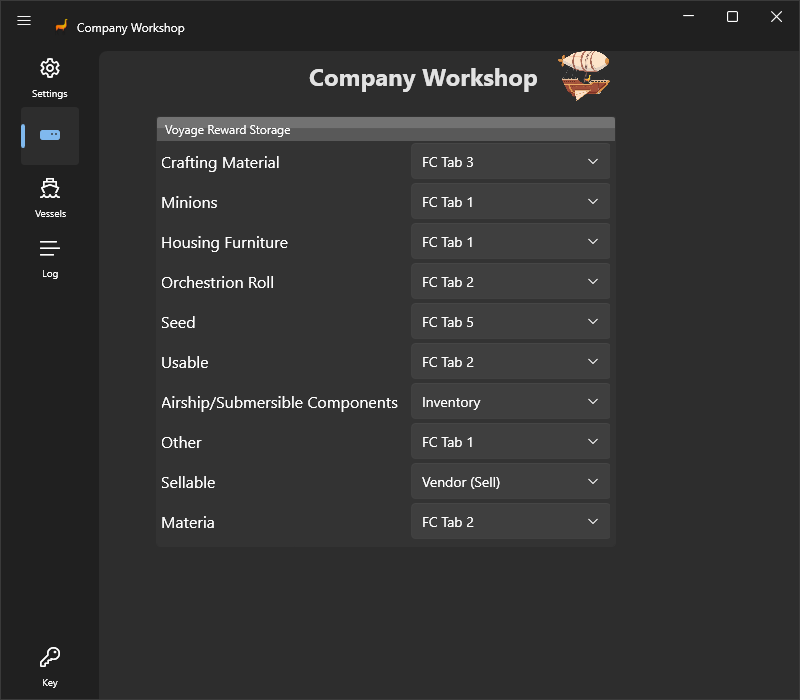
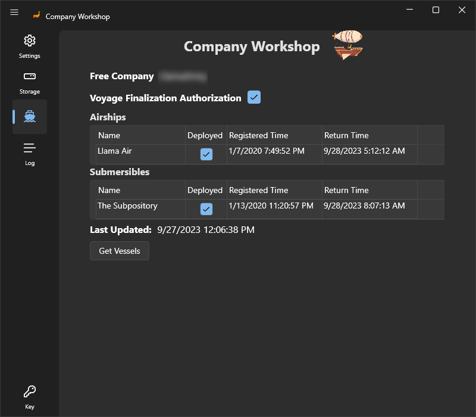
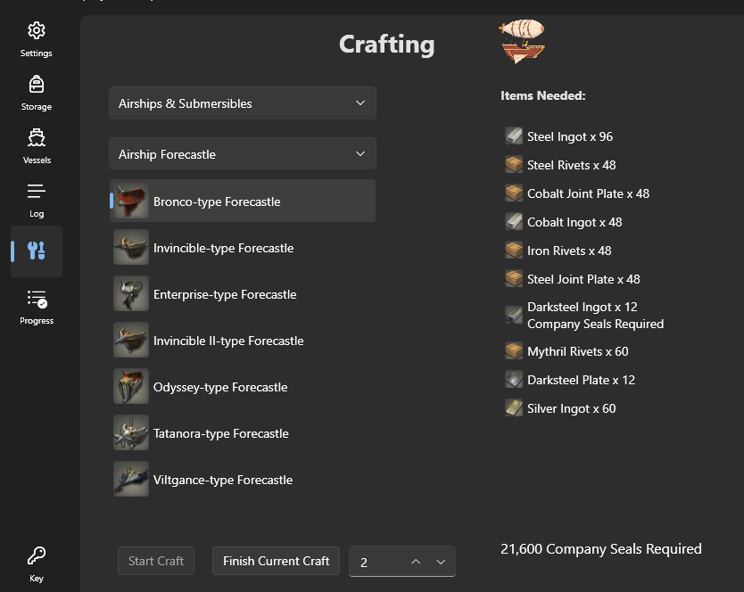
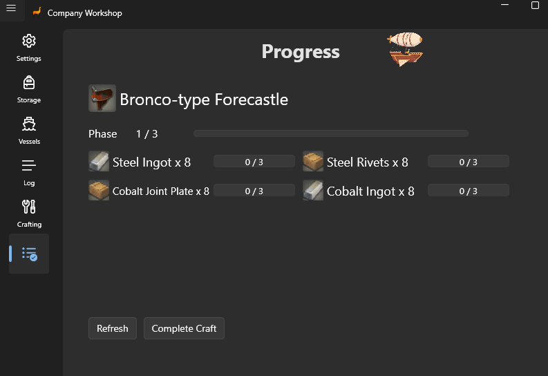

# Company Workshop

Company Workshop is a new botbase which will automate the redeployment and repair of your Free Company's airships and submersibles. It also automates crafting of airship/sub parts in the FC workshop. Crafting the parts from start to finish including grinding for and gathering any GC shop needed materials.

This botbase updates on restart of RebornBuddy and doesn't need to be added to updateBuddy.

## Features

- Airship/Sub Expeditions
    - Resend active vessels on the same expedition
    - Repair ship
    - Store rewards in retainers and company chest
    - Lisbeth and orderbot hooks
    - Settings saved on per FC basis so same storage settings can be used on multiple characters
- Workshop Crafting
    - Start and complete a project from start to finish automatically
    - Finish completing an already started project
    - Craft multiple of the same item
    - Automatically grinds for GC seals and buys required items
    - In game overlay to see the progress of the Lisbeth order as well as run stats when it has to grind Siren Song Sea for seals
    - Uses Lisbeth to craft the parts

## Screenshots

??? tip "Examples"
    {.center .xsmall}
    {.center .xsmall}
    {.center .xsmall}
    {.center .xsmall}
    {.center .xsmall}
    {.center .xsmall}
    {.center .xsmall}

## Requirements

- [RebornBuddy][7] with active license (paid)
- [LlamaLibrary][10] (free)
- [Lisbeth][9] with active license (paid)

## Purchasing

You can request a 72 hour trial of any of my plugins by joining our [![Discord][3]][4] and typing `/trial` on the #bot-spam channel.

You can purchase it using this button:
??? tip "Purchase"
    [Purchases](https://llamamagic.net/purchase/nt153133/purchase/)


## Installation

1. Download the latest version by following the link [here](https://companyworkshop.llamaserver.com/CompanyWorkshop.zip).
2. On the `.zip` file, right click > `Properties` > `Unblock` > `Apply`.
3. Unzip all contents into `RebornBuddy\BotBases\` so it looks like this:

```
RebornBuddy
└── BotBases
    └── CompanyWorkshop
        ├── zh
        ├── CompanyWorkshop.dll
        ├── LlamaAuth.dll
        ├── Microsoft.Bcl.AsyncInterfaces.dll
        └── Wpf.Ui.dll
```

## Limitations

- Only resends ships on the same expedition they have finished
- Current cannot handle if all of a ship's parts break at the same time. The issue is that the parts whose condition is 0% or 100% both come back as 100%. So don't get cheap on repair materials, you want your ships to repair before they hit 0% and there won't be an issue so set the threshold on like 30% or heck even 50%.
- Full automated crafting on Housing items that require multiple stages like the Full Estate Exterior is not supported currently. It should be able to finish the current stage for you but more testing will need to be done if there's reasonable interest in it.

[3]: https://img.shields.io/badge/Discord-7389D8?logo=discord&logoColor=ffffff&labelColor=6A7EC2
[4]: https://discord.gg/CucSWEhJSZ "Discord"
[5]: https://shields.io/badge/-Buy%20me%20a%20coffee-FF5E5B?logo=kofi&logoColor=ffffff&labelColor=FF5E5B
[6]: https://ko-fi.com/domesticwarlord86 "Donate via Ko-Fi"
[7]: https://www.rebornbuddy.com/ "RebornBuddy"
[8]: https://github.com/LlamaMagic/ExBuddy "ExBuddy"
[9]: https://www.siune.io/ "Lisbeth"
[10]: https://github.com/nt153133/__LlamaLibrary "LlamaLibrary"
[11]: https://discord.gg/rDsFbKr "Magitek Discord"
[12]: https://github.com/Zimgineering/repoBuddy "RepoBuddy"