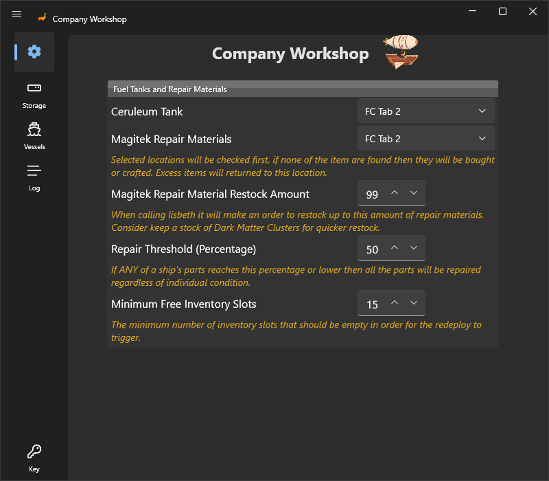
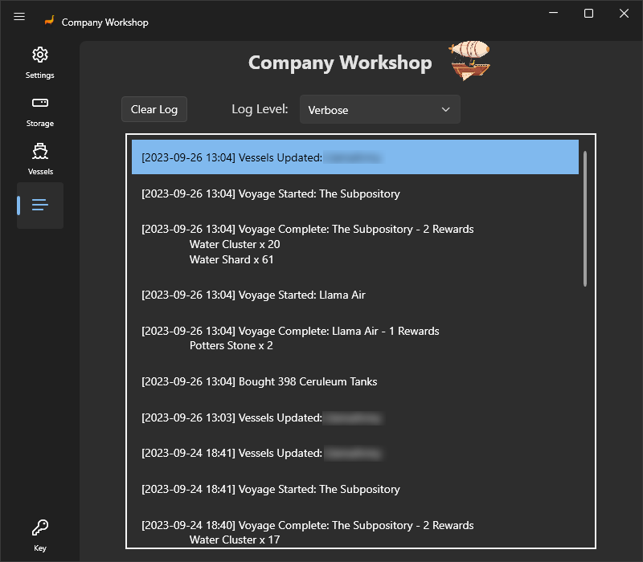
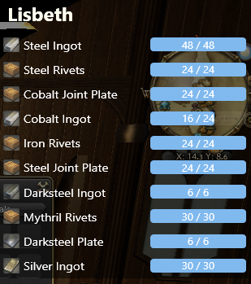
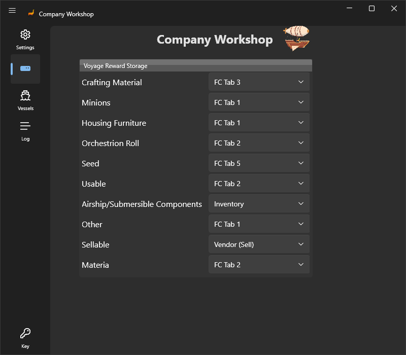
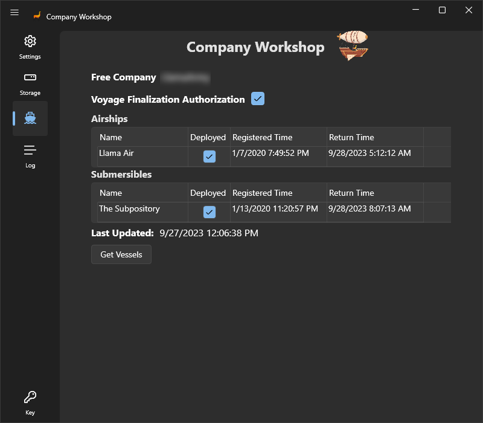
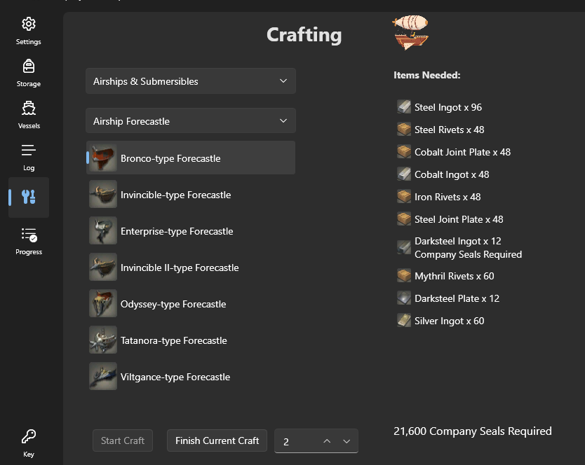
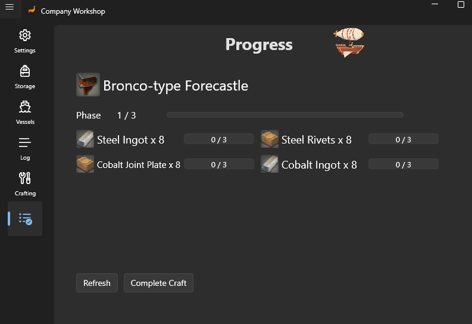

# Company Workshop

Company Workshop is a BotBase designed to automate the redeployment and repair of your Free Company's airships and submersibles. Additionally, it fully automates the crafting of airship and sub parts in the FC workshop from start to finish—even grinding for and gathering any required Grand Company shop materials!

???+ warning "Requirements & Compatibility"
    * **Lisbeth Required:** This botbase relies on Lisbeth to craft parts and requires an active paid license.
    * **LlamaLibrary:** Requires LlamaLibrary (free) to be installed.
    * **Supported Regions:** Fully supports **Global (NA/EU/JP/SA)** and **Chinese** clients. It does *not* currently support Traditional Chinese clients.

## Airship & Submersible Expeditions

* **Automated Redeployment:** Effortlessly resend active vessels on the same expedition they just completed. The botbase handles repairing ships automatically to ensure zero downtime.
* **Smart Loot Storage:** Automatically offload and store expedition rewards directly into your retainers or the Company Chest.
* **Multi-Character Scaling:** Settings are saved on a per-FC basis, meaning the exact same storage and routing settings can be used across multiple characters in the same Free Company.
* **Automation Hooks:** Includes built-in Lisbeth and Orderbot hooks for advanced users.

## Workshop Crafting Automation

* **Start-to-Finish Crafting:** Fully automates the crafting of airship and submersible parts in the FC workshop. Start new projects from scratch, finish already-started projects, or seamlessly queue up multiple of the same item.
* **Autonomous Seal Grinding:** Missing GC shop materials? The botbase will automatically grind Siren Song Sea for Grand Company seals and purchase the required items.
* **Real-Time Overlay:** Features a helpful in-game overlay to track the live progress of your Lisbeth crafting orders, as well as run statistics during GC seal dungeon grinds.

## Limitations & Important Notes

???+ info "Current Constraints"
    * **Route Selection:** The bot will only resend ships on the **same** expedition they just finished.
    * **Housing Projects:** Fully automated crafting on multi-stage housing items (like the Full Estate Exterior) is not currently supported. The bot can finish the *current* stage for you, but will not automate the entire chain. (More testing will be done if there is reasonable interest in this feature).
    
## Screenshots

???+ tip "Examples"
    {.center .xsmall}
    {.center .xsmall}
    {.center .xsmall}
    {.center .xsmall}
    {.center .xsmall}
    {.center .xsmall}
    {.center .xsmall}

## Requirements

- [RebornBuddy][7] with active license (paid)
- [LlamaLibrary][10] (free)
- [Lisbeth][9] with active license (paid)

## Purchasing

You can request a 72 hour trial of any of my plugins by joining our [![Discord][3]][4] and typing `/trial` on the #bot-spam channel.

You can purchase it using this button:
??? tip "Purchase"
    [Purchases](https://llamamagic.net/purchase/nt153133/purchase/)


## Installation

1. Download the latest version by following the link [here](https://companyworkshop.llamaserver.com/CompanyWorkshop.zip).
2. On the `.zip` file, right click > `Properties` > `Unblock` > `Apply`.
3. Unzip all contents into `RebornBuddy\BotBases\` so it looks like this:

```
RebornBuddy
└── BotBases
    └── CompanyWorkshop
        ├── zh
        ├── CompanyWorkshop.dll
        ├── LlamaAuth.dll
        ├── Microsoft.Bcl.AsyncInterfaces.dll
        └── Wpf.Ui.dll
```

## Limitations

- Only resends ships on the same expedition they have finished
- Current cannot handle if all of a ship's parts break at the same time. The issue is that the parts whose condition is 0% or 100% both come back as 100%. So don't get cheap on repair materials, you want your ships to repair before they hit 0% and there won't be an issue so set the threshold on like 30% or heck even 50%.
- Full automated crafting on Housing items that require multiple stages like the Full Estate Exterior is not supported currently. It should be able to finish the current stage for you but more testing will need to be done if there's reasonable interest in it.

[3]: https://img.shields.io/badge/Discord-7389D8?logo=discord&logoColor=ffffff&labelColor=6A7EC2
[4]: https://discord.gg/CucSWEhJSZ "Discord"
[5]: https://shields.io/badge/-Buy%20me%20a%20coffee-FF5E5B?logo=kofi&logoColor=ffffff&labelColor=FF5E5B
[6]: https://ko-fi.com/domesticwarlord86 "Donate via Ko-Fi"
[7]: https://www.rebornbuddy.com/ "RebornBuddy"
[8]: https://github.com/LlamaMagic/ExBuddy "ExBuddy"
[9]: https://www.siune.io/ "Lisbeth"
[10]: https://github.com/nt153133/__LlamaLibrary "LlamaLibrary"
[11]: https://discord.gg/rDsFbKr "Magitek Discord"
[12]: https://github.com/Zimgineering/repoBuddy "RepoBuddy"
