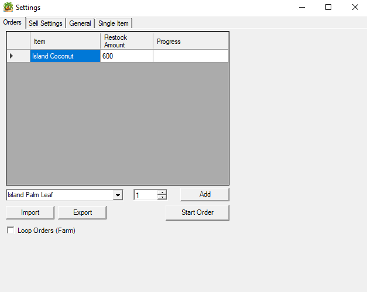
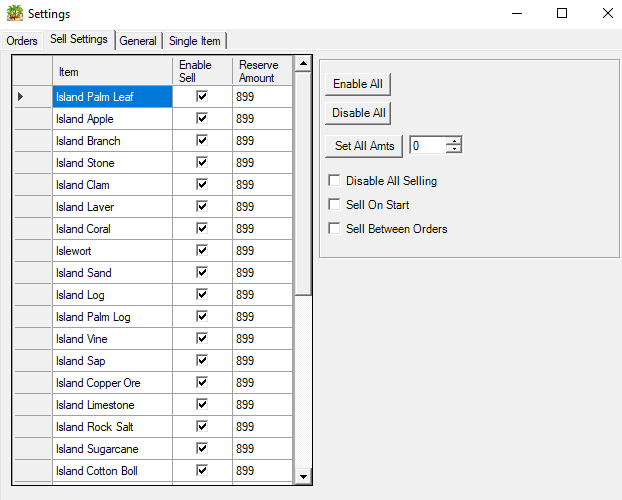
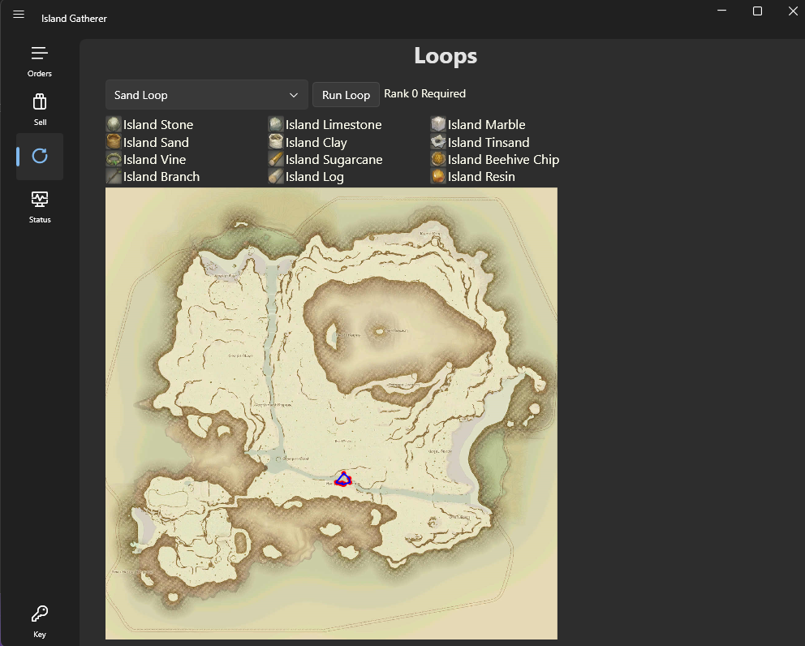
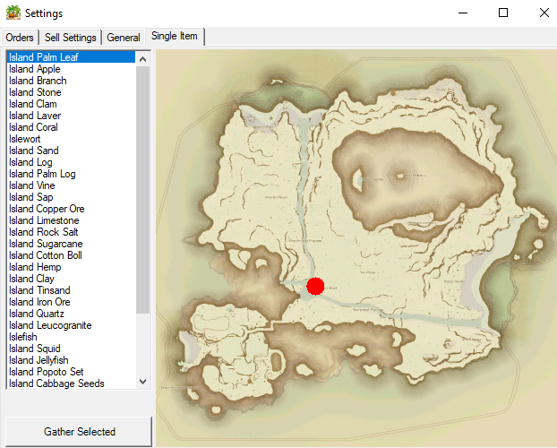

# Island Gatherer

## Island Gatherer

This BotBase is designed to gather resources on your very own private Island Sanctuary. Information on Island Sanctuary can be found here: [FFXIV Console Games Wiki](https://ffxiv.consolegameswiki.com/wiki/Island_Sanctuary)

**For NA/EU/JP/SA only. Not China or Korea**

This BotBase updates on restart of RebornBuddy and doesn't need to be added to repoBuddy.

## Requirements

- [RebornBuddy][7] with active license (paid)
- [Lisbeth][9] with active license (paid)
- [LlamaLibrary][10] (free)

## Installation

1. Download the latest version by following the link in your purchase email.
2. On the `.zip` file, right click > `Properties` > `Unblock` > `Apply`.
3. Unzip all contents into `RebornBuddy\BotBases\` so it looks like this:

```
RebornBuddy
└── BotBases
    └── IslandGatherer
        ├── IslandGatherer
        ├── IslandGathererLoader
        ├── LlamaAuth
        ├── Version.txt
        ├── DataHandling      
        └── Images
```

## Setup

### Orders Tab
??? example inline end

     
This tab is going to be the main one you use. From here you use the drop down to select the item you are wanting to gather, the quantity, and then click `Add`. When you have all the items you want added, press the `Start Order` button and off the bot will go.

* `Import` and `Export` buttons allow you to export the saved order list for use later or sharing.
* `Loop Orders (Farm)` this check box will cause the order to continue over and over once it's completed.

### Sell Settings Tab
??? example inline end

     
This tab is used for selling off gathering materials. If you cap out on a material, you can no longer gather from that node. This is mainly an issue because most nodes have more than one material on them. So if you go for Material A, that spawns on the same node as Material B, but you're maxed out on Material B, you will not be able to gather Material A. I recommend keeping most things at around 899. This prevents you from running into any issues.

### General Tab
??? example inline end

     
This tab is mainly for putting your bot key in and validating it.

* `Only use one location per item` will make the bot not travel across the map to gather from a different location. Can cause issue getting stuck if there's no other nearby nodes.
* `Use better node search` /shrug
* `Use Lisbeth` there's one node that requires flying to get. Enable this and make sure you turn on flying for Unamed Island in Lisbeth settings.
* `Go To Island` nice handy button for those of us who are lazy and want an easy way to get back to the island.

### Single Item Tab
??? example inline end

     
This tab is mainly here because nt spent forever getting the pretty map to work and he likes it. It's only use is to go gather a single material. Not very useful, but it's pretty.

[3]: https://img.shields.io/badge/Discord-7389D8?logo=discord&logoColor=ffffff&labelColor=6A7EC2
[4]: https://discord.gg/CucSWEhJSZ "Discord"
[5]: https://shields.io/badge/-Buy%20me%20a%20coffee-FF5E5B?logo=kofi&logoColor=ffffff&labelColor=FF5E5B
[6]: https://ko-fi.com/domesticwarlord86 "Donate via Ko-Fi"
[7]: https://www.rebornbuddy.com/ "RebornBuddy"
[8]: https://github.com/LlamaMagic/ExBuddy "ExBuddy"
[9]: https://www.siune.io/ "Lisbeth"
[10]: https://github.com/nt153133/__LlamaLibrary "LlamaLibrary"
[11]: https://discord.gg/rDsFbKr "Magitek Discord"
[12]: https://github.com/Zimgineering/repoBuddy "RepoBuddy"