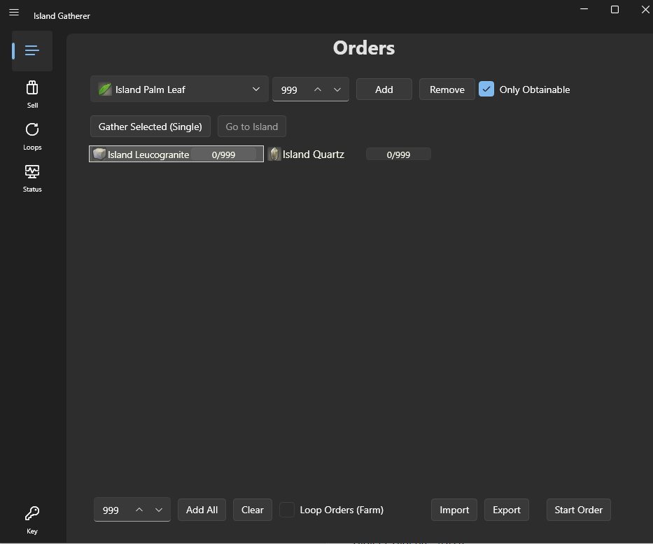
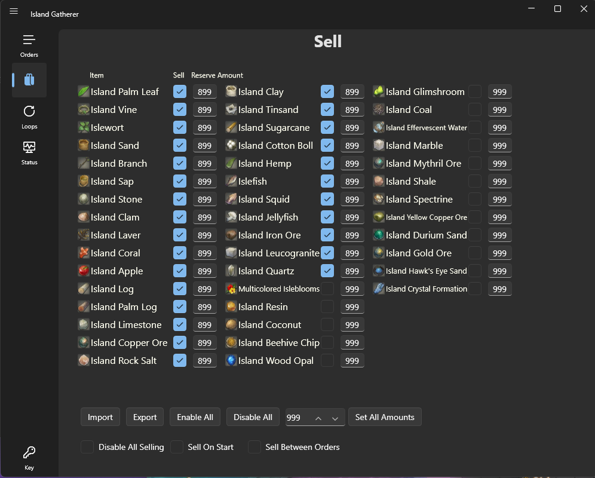
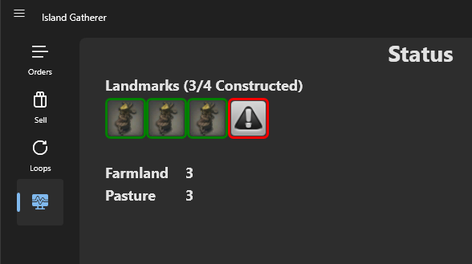

# Island Gatherer

## Island Gatherer

This BotBase is designed to gather resources on your very own private Island Sanctuary. Information on Island Sanctuary can be found here: [FFXIV Console Games Wiki](https://ffxiv.consolegameswiki.com/wiki/Island_Sanctuary)


This BotBase updates on restart of RebornBuddy and doesn't need to be added to repoBuddy.

## Requirements

- [RebornBuddy][7] with active license (paid)
- [LlamaLibrary][10] (free)

## Installation

1. Download the latest version by following the link [here](https://islandgatherer.llamaserver.com/IslandGatherer.zip).
2. On the `.zip` file, right click > `Properties` > `Unblock` > `Apply`.
3. Unzip all contents into `RebornBuddy\BotBases\` so it looks like this:

```
RebornBuddy
└── BotBases
    └── IslandGatherer
        ├── IslandGatherer
        ├── IslandGathererLoader
        ├── LlamaAuth
        ├── Version.txt
        ├── DataHandling      
        └── Images
```

## Tabs
???+ Orders
    {.center .xsmall}

    This tab is going to be the main one you use. From here you use the drop down to select the item you are wanting to gather, the quantity, and then click Add. When you have all the items you want added, press the Start Order button and off the bot will go.

    * `Import` and `Export` buttons allow you to export the saved order list for use later or sharing.
    * `Loop Orders (Farm)` this check box will cause the order to continue over and over once it's completed.

???+ Sell
    {.center .xsmall}

    This tab is used for selling off gathering materials. If you cap out on a material, you can no longer gather from that node. This is mainly an issue because most nodes have more than one material on them. So if you go for Material A, that spawns on the same node as Material B, but you're maxed out on Material B, you will not be able to gather Material A. I recommend keeping most things at around 899. This prevents you from running into any issues.

???+ Loops
    {.center .xsmall}

    This tab is used to run predefined loops for certain items.

???+ Status
    {.center .xsmall}

    Newly added is the Status page that's there to help with those quests where you have to have all the building built and farm leveled. It will show you what landmarks you have built. If it's a green outline you're good, Red you didn't build anything there, Orange you need to go to the sign and click on it to finish building. If you click on the landmark icon it will take you there


[3]: https://img.shields.io/badge/Discord-7389D8?logo=discord&logoColor=ffffff&labelColor=6A7EC2
[4]: https://discord.gg/CucSWEhJSZ "Discord"
[5]: https://shields.io/badge/-Buy%20me%20a%20coffee-FF5E5B?logo=kofi&logoColor=ffffff&labelColor=FF5E5B
[6]: https://ko-fi.com/domesticwarlord86 "Donate via Ko-Fi"
[7]: https://www.rebornbuddy.com/ "RebornBuddy"
[8]: https://github.com/LlamaMagic/ExBuddy "ExBuddy"
[9]: https://www.siune.io/ "Lisbeth"
[10]: https://github.com/nt153133/__LlamaLibrary "LlamaLibrary"
[11]: https://discord.gg/rDsFbKr "Magitek Discord"
[12]: https://github.com/Zimgineering/repoBuddy "RepoBuddy"