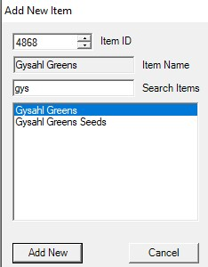

# LlamaMarket

LlamaMarket is a powerful botbase designed to Sell and Buy things on the FFXIV MarketBoard.

## Quick Start ##

[](https://youtu.be/iMwd7_BbilM)


## Selling ##
{ align=right }

This window contains all the items LlamaMarket will sell on the MarketBoard. 


### Global Selling List ###

#### Add New ####


Clicking `Add New` will open the above window. You can add an Item either by ItemID or name. Once selected, hit `Add New` again.

### Edit Item To Sell ###
[](img/edititem.jpg){ align=right }


#### Test 1 ####

| Setting      | Description                          |
| ----------- | ------------------------------------ |
| `HQ`       | Whether or not to list HQ items. This is very literal. If HQ is selected it will ONLY sell HQ. If it's not, it will ONLY sell NQ.  |
| `Number of Listings`       | How many listings of this item to list. I.E. if you want to sell 5 stacks of this item, you'd put 5 here. |
| `Reserve Amount`    | How many of this item you'd like to retain in your inventory that won't be sold.|
| `Stack_Size`    | How many of this item LlamaMarket should sell at a time. I.E. selling a stack of 20 Gysahl Greens at a time.|

#### Test 2 ####
??? "HQ"

    Whether or not to list HQ items. This is very literal. If HQ is selected it will ONLY sell HQ. If it's not, it will ONLY sell NQ.

??? "Number of Listings"

    How many listings of this item to list. I.E. if you want to sell 5 stacks of this item, you'd put 5 here. 
 
??? "Reserve Amount"

    How many of this item you'd like to retain in your inventory that won't be sold. 

??? "Stack Size" 

    How many of this item LlamaMarket should sell at a time. I.E. selling a stack of 20 Gysahl Greens at a time.     

#### Test 3 ####

!!! Editing Item To Sell

    === "Listing"

        ``` markdown
        * HQ 
          - Whether or not to list HQ items. This is very literal. If HQ is selected it will ONLY sell HQ. If it's not, it will ONLY sell NQ.
        * Number of Listings
          - How many listings of this item to list. I.E. if you want to sell 5 stacks of this item, you'd put 5 here.
        * Reserve Amount
          - How many of this item you'd like to retain in your inventory that won't be sold.
         * Stack Size  
          - How many of this item LlamaMarket should sell at a time. I.E. selling a stack of 20 Gysahl Greens at a time.
        ```

    === "Main"

        ``` markdown
        * Enabled
          - Whether or not to sell this item. True sells, false diables.
        * Priority
          - What priority to sell this item. This comes into play when you're selling more items then you have retainers to sell for. I.E. you have 100 items to sell, but only 60 retainer slots to sell on. Lower numbered priorities get listed first. 0 is the first priority.
        * Temporary
          - Is this a temporary listing? Used for if you want it to sell once then go away.
        ```

    === "Pricing"

        ``` markdown
        * Max Price
          - The maximum price you want this to sell for. Leave default to let MB decide.
        * Min Price
          - The minimum price you want this to sell for. Leave default to let MB decide.
        * Undercut Strategy
          - HistoryLimited
            - Uses the past purchase history (from that button in the listings window which shows the last 20 sales) to keep your posts from being priced more than 2 standard deviations from the mean of past sales. Either higher or lower. It also uses the history to set the price if there is no current listings
          - GlobalDefault
            - Is currently the same as HistoryLimited
          - BypassQty
            - Don't know yet
          - HistoryBypass
            - Waiting on tuck
        ```        


#### Right Pane ####
Use the settings on the right side when using the `Edit All` button on the main page. These dictate what value you want to edit on all the listing you have selected. Say you've selected 5 items and want to change the number of stacks you want to sell for all five of those listings. You'd set `Change Stack Size` to True, change the Stack Size on the left panel, and then save. The Stack Size will have changed on all 5 items.

### Character Selling List ###

### Options ###

## Buying ##

### DC Buying List ###

### Character Buying List ###

### Options ###

## Global Settings ##

### License ###

### IDs ###