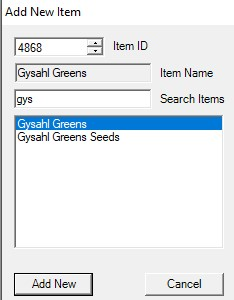
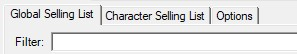

# LlamaMarket Selling

## Setup

### Add New
??? example inline end

    

Clicking `Add New` will open the [Add New Item](img/addnewitem.jpg) window. You can add an Item either by ItemID or name. Once selected, hit `Add New` again. After `Add New` you will be prompted to edit the item's settings or not. No will take the default settings, which you can change later. Yes will open then `Edit Item For Sale` which you read about [below](#edit-item-for-sale).

### Global/Character Selling List
??? example inline end

    

Global Sellings List and Character Selling List are basically the same thing except Character Selling is character specific where as Global affects all characters. If you add Gysahl Greens to the Character Selling list and then switch characters, you won't see it on the list. Where as if you put it in Global it would be visible on all character.

### Options

???+ question "Botbase Run"
    ???+ info "Loop"
        This option causes the LlamaMarket botbase to continually loop. Good for if you have a bunch of stuff to sell in your inventory and just want it to sell for a while.
    ???+ info "Sell Enabled"
        This option controls whether or not LlamamMarket sells items. Generally want this to be True.
    ???+ info "Min Time"
        When the `Loop` option is turned on, this is the minimum amount of time  

???+ question "Retainer Tasks"
    ???+ info "Retrieve Gil"
        This option causes LlamaMarket to retrieve gil from retainers when the make a sell. Some people like to see their pockets get big, some people want to see their friends succeed. You do you.
    ???+ info "Refresh Ventures"
        This option controls whether or not LlamamMarket will send retainers back out on their ventures. Generally want this to be True.
    ???+ info "Retrieve Items"
        This option controls whether LlamaMarket will pull items from your retainers to sell on the MarketBoard. 

???+ question "Selling Items"
    ???+ info "Default Undercut Strategy"    
        Controls the GlobalDefault selling strategy for new items.
    ???+ question "Minimum Retainer Slots to Update"
        Number of free retainer listing slots to exceed before running sellings tasks.
    ???+ question "Minimum Old Prices to Update"
        Number of prices that need updating to exceed before running sellings tasks.              
    ???+ question "Don't Undercut Twice"
        If true, won't undercut the same player twice in a row so as to avoid competing with another undercut bot and bottoming prices out.

???+ question "Timing"
    ???+ info "Wait Time"    
        Amount of time, in minutes, to wait between selling operations. Set to 0 to disable and use only when resending ventures.        

## Edit Item For Sale
Below is a list of settings you'll find in the `Edit Item for Sale` window.

???+ question "Left Pane"
    ???+ info "HQ"

        Whether or not to list HQ items. This is very literal. If HQ is selected it will ONLY sell HQ. If it's not, it will ONLY sell NQ.

    ???+ info "Number of Listings"

        How many listings of this item to list. I.E. if you want to sell 5 stacks of this item, you'd put 5 here. 
    
    ???+ info "Reserve Amount"

        How many of this item you'd like to retain in your inventory that won't be sold. 

    ???+ info "Stack Size" 

        How many of this item LlamaMarket should sell at a time. I.E. selling a stack of 20 Gysahl Greens at a time.    

    ???+ info "Enabled" 

        Whether or not to sell this item. True sells, false diables. 

    ???+ info "Priority" 

        What priority to sell this item. This comes into play when you're selling more items then you have retainers to sell for. I.E. you have 100 items to sell, but only 60 retainer slots to sell on. Lower numbered priorities get listed first. 0 is the first priority.    

    ???+ info "Temporary" 

        Is this a temporary listing? Used for if you want it to sell once then go away.   

    ???+ info "Max Price" 

        The maximum price you want this to sell for. Leave default to let MB decide.  

    ???+ info "Min Price" 

        The minimum price you want this to sell for. Leave default to let MB decide. 

    ???+ info "Undercut Strategy" 

        - HistoryLimited
            - Uses the past purchase history (from that button in the listings window which shows the last 20 sales) to keep your posts from being priced more than 2 standard deviations from the mean of past sales. Either higher or lower. It also uses the history to set the price if there is no current listings
        - GlobalDefault
            - Is currently the same as HistoryLimited. Controled under the Options tab.
        - BypassQty
            - Supposed to use slightly better logic when dealing with certain item posting quantities like if you're only trying to post x30 of something it's gonna ignore (at least a few) x99 stacks to avoid the people that just yeet x99 stacks of stuff on the MB for cheap
        - HistoryBypass
            - Waiting on tuck                

??? note "Right Pane" 

    Use the settings on the right side when using the `Edit All` button on the main page. These dictate what value you want to edit on all the listing you have selected. Say you've selected 5 items and want to change the number of stacks you want to sell for all five of those listings. You'd set `Change Stack Size` to True, change the Stack Size on the left panel, and then save. The Stack Size will have changed on all 5 items.

