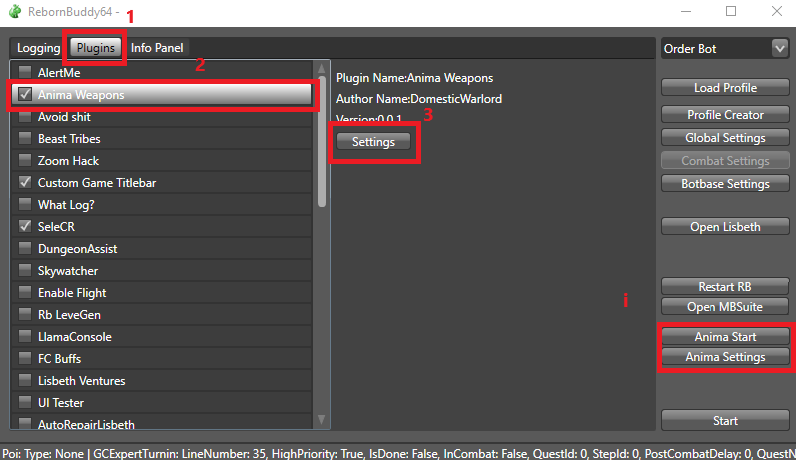
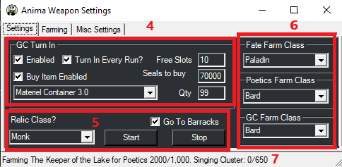
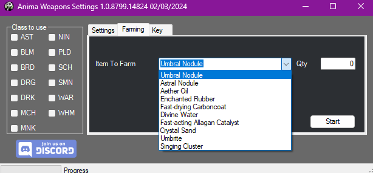
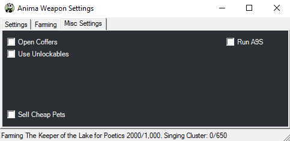

# Anima Relic Weapons

[![Discord][3]][4]
[](https://github.com/sponsors/domesticwarlord86)
[![Donate][5]][6]

This plugin is designed to obtain your level 60 Anima weapon with as little interaction from the user as possible. Information on these weapons can be found here: [FFXIV Console Games Wiki](https://ffxiv.consolegameswiki.com/wiki/Anima_Weapons)

This plugin updates on restart of RebornBuddy and doesn't need to be added to repoBuddy.

## Requirements

- [RebornBuddy][7] with active license (paid)
- [Lisbeth][9] with active license (paid)
- [LlamaLibrary][10] (free)

## Installation

1. Download the latest version by following the link in your purchase email.
2. On the `.zip` file, right click > `Properties` > `Unblock` > `Apply`.
3. Unzip all contents into `RebornBuddy\Plugins\` so it looks like this:

```
RebornBuddy
└── Plugins
    └── AnimaWeapons
        ├── OrderBot Tags
        ├── AnimaWeaponsLoader.cs
        ├── AnimaWeaponsSettings.cs
        ├── Version.txt
        └── AnimaWeapons.dll
```

## Setup

Make sure to have your relic weapon in your inventory so the plugin can determine which step you are on.

Make sure you have completed your class quests up through level 60 to begin the relic quest.

- **This plugin does take advantage of GCExpertTurnIn, as such they will turn any available item in your _INVENTORY_ to the grand company for seals. This does not affect Armory, Chocobo Satchel, or Retainers. So please store any important items in one of those locations before running this set. (Your relic weapon cannot be turned in and should be kept in your inventory)**

I also recommend using my PandaPlugins set found here: [PandaPlugins](https://github.com/domesticwarlord86/PandaPlugins). Mainly for the plugins Osiris, which will prevent the bot from crapping out when you die, Vulcan, which will use a Mender when your gear is low as well as Gluttony for eating food. You can also use the Extractor plugin to extract materia from fully spirit bound items.

## Usage

1. Click the Plugins tab in the RebornBuddy window
2. Select Anima Weapons from the Plugin list
    * You may notice that Enabling the Anima Weapons plugin gives you two quick references buttons on your main RB window.
3. Click Settings
{.center .xsmall}
4. GC Turn In settings
    * `Enabled` - Turn this on if you'd like the bot to turn in gear in your inventory for Grand Company seals. It will turn in any item in your inventory that is eligible. Inventory ONLY, not armory or anything else.
    * `Turn In Every Run?` & `Free Slots` - Assuming you enabled GC Turn In, would you like it to turn in after every run, or at a set amount of free inventory slots. One or the other, not both. If `Turn In Every Run` is checked, Free Slots is ignored.
    * `Buy Item Enabled`, `Seals To Buy`, `GC Item` & `Qty` - If you turn on GC Turn In you're going to cap out on seals while running this. Capping out on seals will cause GC Turn In to break and stop the bot. To prevent that, you'll want to buy items to keep it from capping out. Enable this feature by checking `Buy Item Enabled` then select what item you want to buy in the drop down, and set how many you want to buy in `Qty` (Setting 999 will cause it to buy as many as you can afford). `Seals to buy` controls when GC Buy Item is triggered. I set it to about 20k from my cap, so that I never risk hitting the cap
5. Relic Class settings
    * `Relic Class?` - This is what classes's relic you are after.
    * `Go To Barracks` - This will have your character go to your Grand Company's Barrack chamber between dungeon runs.
6. Farm Class settings
    * `Fate Farm Class` - During the `Soul Without Life` stage of the relic quest, you will be farming FATEs in Heavensward zones to get elemental crystal drops. These are around level 60 FATEs and can be done on any class. I typically recommend something good at soloing like PLD or RDM.
    * `Poetics Farm Class` - At various points in the relic quest you will need to farm Allagan Tomestones of Poetic. The plugin will run `Keeper of the Lake` with a Duty Support squad to get Tomes. It's a level 50 dungeon and can be done on any class.
    * `GC Farm Class` - At various points in the relic quest you will need to farm Greater Company Seals. The plugin will run `The Sirensong Sea` uncapped to get gear to turn in at your grand company for seals. It's a level 50 dungeon and can be done on any class.
7. Here you will see your current farming status. It updates every 30 seconds and acts as a good 'at a glance' feature to let you know what the bot is doing.
{.center .xsmall}
8. Once you have the settings the way you like, hit Start.

### Farming Tab

{.center .xsmall}

By default, using the normal settings tab and start button will obtain the relic for the selected class from start to finish, doing everything required. This tab is for people who like to do all their farming ahead of time. You can set it for how many you want, and then hit start for that tab. For instance if you wanted to go ahead and get all the elemental crystals for every class, you can put in 26 and hit start for the Animated Stage Farm and it will gather 26 of the crystals. The Track check box in each category makes the status bar at the bottom track that farming cycle.

### Misc Settings

{.center .xsmall}

   * `Open Coffers` This option is used to open any coffers in your inventory. Mostly used for when farming Material Containers with GC Seals. It will also open any kind of class specific coffers you're holding too, so keep that in mind. This does not affect opening treasure chests in dungeons.
   * `Use Unlockables` This will cause the bot use any not-learned unlockable you have in your inventory. Like minions, orchestration rolls or mounts. Good for when opening material containers.
   * `Sell Cheap Pets` this is mainly for my own use. It sells a few set pets that I have hard coded into the plugin. Ones that usually sell for less than 1000 gil on the MB.
   * `Run A9S` by default during the `Born Again Anima` stage of the quest the plugin will run Brayflox Longstop Hard for light farming. This option has it run Alexander - The Eyes of the Curator (Savage) instead. A9S is MUCH faster, but requires you to have it unlocked.

## Current Progress

### Animated Weapons
- [x] An Unexpected Proposal
- [x] Soul Without Life

### Awoken Weapons
- [x] Toughening Up

### Anima Weapons
- [X] Coming into Its Own 

### Hyperconductive Weapons
- [X] Finding Your Voice

### Reconditioned Weapons
- [X] A Dream Fulfilled <sup>See [notes](#a-dream-fulfilled)</sup>

### Sharpened Weapons
- [X] Future Proof

### Complete Weapons
- [X] Born Again Anima <sup>See [notes](#born-again-anima)</sup>
- [X] Some Assembly Required
- [X] Body and Soul

### Lux Weapons
- [X] Words of Wisdom
- [X] Best Friends Forever <sup>See [notes](#best-friends-forever)</sup>

## Notes
### A Dream Fulfilled
This stage has you farming 60 Umbrite and 60 Crystal Sand. The Umbrites come from poetics, totalling 4500 poetics. At roughly ~20min a run for 100 poetics, this is going to take 15 solid hours of farming.

Once all materials are gathered, the bot will stop in front of the NPC and allow you to choose the secondary stats on your weapon. This must be done manually.
### Born Again Anima
This stage farms Aetheric Density for your weapon. By default it uses Brayflox's Longstop (Hard). Most classes can run this in under 5 minutes a run which means roughly 5 hours of grinding. It does this dungeon unsynced to take full advantage of your level 90 status.

Alternatively you can check the box in Misc Settings for `Run A9S` to run `Alexander - The Eyes of the Curator (Savage)` instead. This is much faster, at under 3 minutes a run for 96 light points, taking under an hour to fully activate your relic. However it does require you to already have this dungeon unlocked, which requires you to have done all the previous Alexander raids which is why it's an option and not the default.

### Best Friends Forever
The unlock quests for Containment Bay trials require a manual step as they have a solo duty that can't be botted. It only needs to be done once, and if you already have the dungeons unlocked you won't have to worry about it at all.

Limitless Blue, Containment Bay P1T6, S1T7, and Z1T9 are all iffy. You should be able to complete them with 90% completion rate in most cases, but if you see the bot struggling, just do it manually. They only have to be ran once per relic and they're pretty quick.

## Known Issues


[3]: https://img.shields.io/badge/Discord-7389D8?logo=discord&logoColor=ffffff&labelColor=6A7EC2
[4]: https://discord.gg/CucSWEhJSZ "Discord"
[5]: https://shields.io/badge/-Buy%20me%20a%20coffee-FF5E5B?logo=kofi&logoColor=ffffff&labelColor=FF5E5B
[6]: https://ko-fi.com/domesticwarlord86 "Donate via Ko-Fi"
[7]: https://www.rebornbuddy.com/ "RebornBuddy"
[8]: https://github.com/LlamaMagic/ExBuddy "ExBuddy"
[9]: https://www.siune.io/ "Lisbeth"
[10]: https://github.com/nt153133/__LlamaLibrary "LlamaLibrary"
[11]: https://discord.gg/rDsFbKr "Magitek Discord"
[12]: https://github.com/Zimgineering/repoBuddy "RepoBuddy"