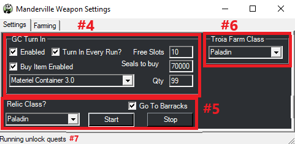

# Anima Relic Weapons

[![Discord][3]][4]
[](https://github.com/sponsors/domesticwarlord86)
[![Donate][5]][6]

This plugin is designed to obtain your level 60 Anima weapon with as little interaction from the user as possible. Information on these weapons can be found here: [FFXIV Console Games Wiki](https://ffxiv.consolegameswiki.com/wiki/Anima_Weapons)

This plugin updates on restart of RebornBuddy and doesn't need to be added to repoBuddy.

## Requirements

- [RebornBuddy][7] with active license (paid)
- [Lisbeth][9] with active license (paid)
- [LlamaLibrary][10] (free)

## Installation

1. Download the latest version by following the link in your purchase email.
2. On the `.zip` file, right click > `Properties` > `Unblock` > `Apply`.
3. Unzip all contents into `RebornBuddy\Plugins\` so it looks like this:

```
RebornBuddy
└── Plugins
    └── AnimaWeapons
        ├── OrderBot Tags
        ├── AnimaWeaponsLoader.cs
        ├── AnimaWeaponsSettings.cs
        ├── Version.txt
        └── AnimaWeapons.dll
```

## Setup

Make sure to have your relic weapon in your inventory so the profile can determine which step you are on.

Make sure you have completed your class quests up through level 60 to begin the relic quest.

- **This plugin does take advantage of GCExpertTurnIn, as such they will turn any available item in your _INVENTORY_ to the grand company for seals. This does not affect Armory, Chocobo Satchel, or Retainers. So please store any important items in one of those locations before running this set. (Your relic weapon cannot be turned in and should be kept in your inventory)**

I also recommend using my PandaPlugins set found here: https://github.com/domesticwarlord86/PandaPlugins. Mainly for the plugins Osiris, which will prevent the bot from crapping out when you die, Vulcan, which will use a Mender when your gear is low as well as Gluttony for eating food. You can also use the Extractor plugin to extract materia from fully spirit bound items.

## Usage

1. Click the Plugins tab in the RebornBuddy window
2. Select Manderville Weapons from the Plugin list
   1. You may notice that Enabling the Manderville Weapons plugin gives you two quick references buttons on your main RB window.
3. Click Settings



4. GC Turn In settings
   1. `Enabled` - Turn this on if you'd like the bot to turn in gear in your inventory for Grand Company seals. It will turn in any item in your inventory that is eligible. Inventory ONLY, not armory or anything else.
   2. `Turn In Every Run?` & `Free Slots` - Assuming you enabled GC Turn In, would you like it to turn in after every run, or at a set amount of free inventory slots. One or the other, not both. If `Turn In Every Run` is checked, Free Slots is ignored.
   3. `Buy Item Enabled`, `Seals To Buy`, `GC Item` & `Qty` - If you turn on GC Turn In you're going to cap out on seals while running this. Capping out on seals will cause GC Turn In to break and stop the bot. To prevent that, you'll want to buy items to keep it from capping out. Enable this feature by checking `Buy Item Enabled` then select what item you want to buy in the drop down, and set how many you want to buy in `Qty` (Setting 999 will cause it to buy as many as you can afford). `Seals to buy` controls when GC Buy Item is triggered. I set it to about 20k from my cap, so that I never risk hitting the cap
5. Relic Class settings
   1. `Relic Class?` - This is what classes's relic you are after.
   2. `Go To Barracks` - This will have your character go to your Grand Company's Barrack chamber between dungeon runs.
6. Troia Farm Class
   1. Choose which class you want to run `The Fell Court of Troia` on. As mentioned below, I recommend a tank.
7. Here you will see your current farming status. It updates every 30 seconds and acts as a good 'at a glance' feature to let you know what the bot is doing.
8. Once you have the settings the way you like, hit Start.

## Current Progress

### Animated Weapons
- [x] An Unexpected Proposal
- [x] Soul Without Life

### Awoken Weapons
- [x] Toughening Up

### Anima Weapons
- [X] Coming into Its Own 

### Hyperconductive Weapons
- [X] Finding Your Voice

### Reconditioned Weapons
- [X] A Dream Fulfilled <sup>See [notes](#a-dream-fulfilled)</sup>

### Sharpened Weapons
- [X] Future Proof

### Complete Weapons
- [X] Born Again Anima <sup>See [notes](#born-again-anima)</sup>
- [X] Some Assembly Required
- [X] Body and Soul

### Lux Weapons
- [X] Words of Wisdom
- [X] Best Friends Forever <sup>See [notes](#best-friends-forever)</sup>

## Notes
### A Dream Fulfilled
This stage has you farming 60 Umbrite and 60 Crystal Sand. The Umbrites come from poetics, totalling 4500 poetics. At roughly ~20min a run for 100 poetics, this is going to take 15 solid hours of farming.

The Crystal Sand can come from multiple locations. This profile supports 3 ways. The fastest of which is Gathering Blue Scrips. Second fastest is Crafting Blue Scrips. Slowest is more poetics. It defaults to gathering, but if you want to change it, open `A DreamFulfilled.xml` and change the option at the top.

Once all materials are gathered, the bot will stop in front of the NPC and allow you to choose the secondary stats on your weapon. This must be done manually.
### Born Again Anima
This stage farms Aetheric Density for your weapon. By default it uses Brayflox's Longstop (Hard). Most classes can run this in under 5 minutes a run which means roughly 5 hours of grinding. It does this dungeon unsynced to take full advantage of your level 90 status.

Alternatively you can change the setting in `Born Again Anima.xml` to 1 to have it run The Antitower with a group of NPCs instead. You get exp (if under 90) as well as poetics for running this dungeon, and better loot drops for more GC Seals. However, it averages ~ 20min a run. At the same 32 points per run you're looking at about 21 hours of grinding. The choice is yours.
### Best Friends Forever
The unlock quests for Containment Bay trials require a manual step as they have a solo duty that can't be botted. It only needs to be done once, and if you already have the dungeons unlocked you won't have to worry about it at all.

Limitless Blue, Containment Bay P1T6, S1T7, and Z1T9 are all iffy. You should be able to complete them with 90% completion rate in most cases, but if you see the bot struggling, just do it manually. They only have to be ran once per relic and they're pretty quick.

## Known Issues


[3]: https://img.shields.io/badge/Discord-7389D8?logo=discord&logoColor=ffffff&labelColor=6A7EC2
[4]: https://discord.gg/CucSWEhJSZ "Discord"
[5]: https://shields.io/badge/-Buy%20me%20a%20coffee-FF5E5B?logo=kofi&logoColor=ffffff&labelColor=FF5E5B
[6]: https://ko-fi.com/domesticwarlord86 "Donate via Ko-Fi"
[7]: https://www.rebornbuddy.com/ "RebornBuddy"
[8]: https://github.com/LlamaMagic/ExBuddy "ExBuddy"
[9]: https://www.siune.io/ "Lisbeth"
[10]: https://github.com/nt153133/__LlamaLibrary "LlamaLibrary"
[11]: https://discord.gg/rDsFbKr "Magitek Discord"
[12]: https://github.com/Zimgineering/repoBuddy "RepoBuddy"