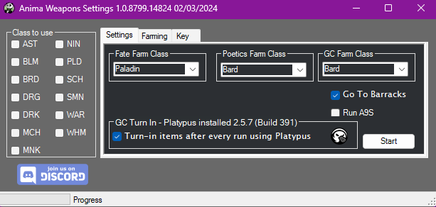
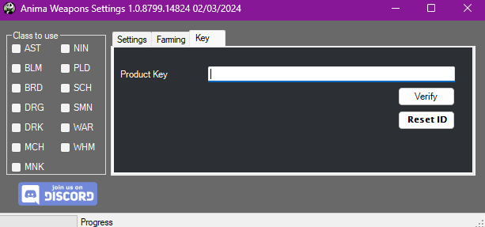

# Anima Relic Weapons

[![Discord][3]][4]
[](https://github.com/sponsors/domesticwarlord86)
[![Donate][5]][6]

This plugin is designed to obtain your level 60 Anima weapon with as little interaction from the user as possible. Information on these weapons can be found here: [FFXIV Console Games Wiki](https://ffxiv.consolegameswiki.com/wiki/Anima_Weapons)

This plugin updates on restart of RebornBuddy and doesn't need to be added to repoBuddy.

## Requirements

- [RebornBuddy][7] with active license (paid)
- [Lisbeth][9] with active license (paid)
- [LlamaLibrary][10] (free)
- [LlamaUtilities](https://github.com/nt153133/LlamaUtilities) (free)
- [Platypus](https://rbplatypus.com/) (free+)
- [RBTrust](https://github.com/LlamaMagic/RBtrust) (free)
- [Osiris](https://github.com/domesticwarlord86/PandaPlugins) (free)

## Purchasing

You can request a 72 hour trial of any of my plugins by joining our [![Discord][3]][4] and typing `/trial` on the #bot-spam channel.

You can purchase it using this button:
??? tip "Purchase"

    <script async src="https://js.stripe.com/v3/buy-button.js">
    </script>
    <stripe-buy-button buy-button-id="buy_btn_1OEZOmFdsj1r46ilVEUUybhb" publishable-key="pk_live_51Mdje9Fdsj1r46ilbr3eeB0vKcThZI0r8J04ZLrPwhcrkTUEjW5168m9xuRYTTkOyAag0rUWqmFhzmEDRcqCUN900038n3jgm8">
    </stripe-buy-button>


## Installation

1. Download the latest version by following the link [here](https://sts.llamamagic.net/AnimaWeapons/AnimaWeapons.zip).
2. On the `.zip` file, right click > `Properties` > `Unblock` > `Apply`.
3. Unzip all contents into `RebornBuddy\Plugins\` so it looks like this:

```
RebornBuddy
└── Plugins
    └── AnimaWeapons
        ├── AnimaWeaponsLoader.cs
        ├── AnimaWeaponsSettings.cs
        ├── Version.txt
        └── AnimaWeapons.dll
```

## Setup

Make sure to have your relic weapon in your inventory so the plugin can determine which step you are on.

Make sure you have completed your class quests up through level 60 to begin the relic quest.

- **This plugin does take advantage of GCExpertTurnIn, as such they will turn any available item in your _INVENTORY_ to the grand company for seals. This does not affect Armory, Chocobo Satchel, or Retainers. So please store any important items in one of those locations before running this set. (Your relic weapon cannot be turned in and should be kept in your inventory)**

I also recommend using my PandaPlugins set found here: [PandaPlugins](https://github.com/domesticwarlord86/PandaPlugins). Mainly for the plugins Osiris, which will prevent the bot from crapping out when you die, Vulcan, which will use a Mender when your gear is low as well as Gluttony for eating food. You can also use the Extractor plugin to extract materia from fully spirit bound items.

## Usage

{.center .xsmall}

1. Relic Class settings
    `Class to use` - These are the classes who's relics we will be obtaining.
2. Farm Class settings
    * `Fate Farm Class` - During the `Soul Without Life` stage of the relic quest, you will be farming FATEs in Heavensward zones to get elemental crystal drops. These are around level 60 FATEs and can be done on any class. I typically recommend something good at soloing like PLD or RDM.
    * `Poetics Farm Class` - At various points in the relic quest you will need to farm Allagan Tomestones of Poetic. The plugin will run `Keeper of the Lake` with a Duty Support squad to get Tomes. It's a level 50 dungeon and can be done on any class.
    * `GC Farm Class` - At various points in the relic quest you will need to farm Greater Company Seals. The plugin will run `The Sirensong Sea` uncapped to get gear to turn in at your grand company for seals. It's a level 50 dungeon and can be done on any class.
3. `Go To Barracks` - Rest in your Grand Company barracks between dungeon farming runs.
4. `Run A9S` - By default during the `Born Again Anima` stage of the quest the plugin will run Brayflox Longstop Hard for light farming. This option has it run Alexander - The Eyes of the Curator (Savage) instead. A9S is MUCH faster, but requires you to have it unlocked.
5. `GC Turn In` - Anima Weapons uses RedWine's [Platypus](https://rbplatypus.com/) botbase to handle Expert Turn In at the grandcompany. It has many inventory and quality of life features and I highly recommend it and configuring it. The button in Anima Weapon's settings will install Platypus for you if you don't already have it. Clicking on the Platypus icon will load it's settings for quick access. 
6. Once you have the settings the way you like, hit `Start`.

### Farming Tab

{.center .xsmall}

By default, using the normal settings tab and start button will obtain the relic for the selected class from start to finish, doing everything required. This tab is for people who like to do all their farming ahead of time. You can set it for how many you want, and then hit start for that tab. For instance if you wanted to go ahead and get all the elemental crystals for every class, you can put in 26 and hit start for the Animated Stage Farm and it will gather 26 of the crystals. The Track check box in each category makes the status bar at the bottom track that farming cycle.
   

### Key Tab

{.center .xsmall}

This tab is pretty straight forward. When you purchase the plugin you'll get a key sent to the email used when making the purchase. Take that key, put it in the box, hit `Verify`. That'll enable the plugin. Job done.

The `Reset ID` button is to be used if you've reached the machine cap for your key and would like to reset it to defaults. You can only use this button once per key. If you need to reset the ID after that please contact me.

## Current Progress

### Animated Weapons
- [x] An Unexpected Proposal
- [x] Soul Without Life

### Awoken Weapons
- [x] Toughening Up

### Anima Weapons
- [X] Coming into Its Own 

### Hyperconductive Weapons
- [X] Finding Your Voice

### Reconditioned Weapons
- [X] A Dream Fulfilled <sup>See [notes](#a-dream-fulfilled)</sup>

### Sharpened Weapons
- [X] Future Proof

### Complete Weapons
- [X] Born Again Anima <sup>See [notes](#born-again-anima)</sup>
- [X] Some Assembly Required
- [X] Body and Soul

### Lux Weapons
- [X] Words of Wisdom
- [X] Best Friends Forever <sup>See [notes](#best-friends-forever)</sup>

## Notes
### A Dream Fulfilled
This stage has you farming 60 Umbrite and 60 Crystal Sand. The Umbrites come from poetics, totalling 4500 poetics. At roughly ~20min a run for 100 poetics, this is going to take 15 solid hours of farming.

Once all materials are gathered, the bot will stop in front of the NPC and allow you to choose the secondary stats on your weapon. This must be done manually.
### Born Again Anima
This stage farms Aetheric Density for your weapon. By default it uses Brayflox's Longstop (Hard). Most classes can run this in under 5 minutes a run which means roughly 5 hours of grinding. It does this dungeon unsynced to take full advantage of your level 90 status.

Alternatively you can check the box in Misc Settings for `Run A9S` to run `Alexander - The Eyes of the Curator (Savage)` instead. This is much faster, at under 3 minutes a run for 96 light points, taking under an hour to fully activate your relic. However it does require you to already have this dungeon unlocked, which requires you to have done all the previous Alexander raids which is why it's an option and not the default.

### Best Friends Forever
The unlock quests for Containment Bay trials require a manual step as they have a solo duty that can't be botted. It only needs to be done once, and if you already have the dungeons unlocked you won't have to worry about it at all.

Limitless Blue, Containment Bay P1T6, S1T7, and Z1T9 are all iffy. You should be able to complete them with 90% completion rate in most cases, but if you see the bot struggling, just do it manually. They only have to be ran once per relic and they're pretty quick.

## Known Issues
- If you have multiple gear sets of the same job, or more gearsets then the game has by default, your drop down menu for class selection may look unusual. The Job change code will select the first job for that class it finds in your gearsets.
- The progress bar at the bottom of the window does not work as of now.


[3]: https://img.shields.io/badge/Discord-7389D8?logo=discord&logoColor=ffffff&labelColor=6A7EC2
[4]: https://discord.gg/CucSWEhJSZ "Discord"
[5]: https://shields.io/badge/-Buy%20me%20a%20coffee-FF5E5B?logo=kofi&logoColor=ffffff&labelColor=FF5E5B
[6]: https://ko-fi.com/domesticwarlord86 "Donate via Ko-Fi"
[7]: https://www.rebornbuddy.com/ "RebornBuddy"
[8]: https://github.com/LlamaMagic/ExBuddy "ExBuddy"
[9]: https://www.siune.io/ "Lisbeth"
[10]: https://github.com/nt153133/__LlamaLibrary "LlamaLibrary"
[11]: https://discord.gg/rDsFbKr "Magitek Discord"
[12]: https://github.com/Zimgineering/repoBuddy "RepoBuddy"