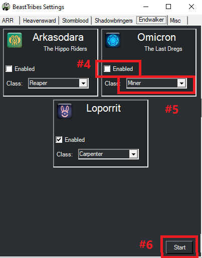

# Beast Trbes

[![Discord][3]][4]
[](https://github.com/sponsors/domesticwarlord86)
[![Donate][5]][6]

This plugin is designed to do the FFXIV Beast Tribe quets with as little interaction from the user as possible. Information on these tribes can be found here: [FFXIV Console Games Wiki](https://ffxiv.consolegameswiki.com/wiki/Tribal_Quests)

## Requirements

- [RebornBuddy][7] with active license (paid)
- [Lisbeth][9] with active license (paid)
- [LlamaLibrary][10] (free)

## Installation

1. Download the latest version by following the link in your purchase email.
2. On the `.zip` file, right click > `Properties` > `Unblock` > `Apply`.
3. Unzip all contents into `RebornBuddy\Plugins\` so it looks like this:

```
RebornBuddy
└── Plugins
    └── BeastTribes
        ├── README.md
        ├── BeastTribesLoader.cs
        ├── Version.txt
        └── BeastTribes.dll
```

## Usage

For now only some of the tribes are available to be enabled. I am in the process of rewriting the other tribes and once they are completed I will activate them inside the plugin.

??? example inline end

    

1. Go to the Plugins tab in RebornBuddy
2. Select Beast Tribes from the menu
3. Click Settings button
4. Enable the tribes you'd like to do
5. Select he classes you want to do that tribe on.
6. Press Start


## Notes


* Keep in mind that you get 12 daily tribe allowances. All tribes except ARR use 3 allowances each. So you can do 4 tribes a day. ARR work differently.
* You must select the class you want for each tribe. Even if it defaults to the class you want, you need to click the drop down and select it manually at least once for it to save your setting.

## Known Issues

- You will get an error upon loading the Settings window if you don't have at least one DoW, DoL, and DoH gear set saved on your character.

### Sylphs

- Some of these quests make you travel through lands that you will get aggro on and mess up the quest. I recommend doing it on a 50+ class.

### Qitari

- Some of the fishing quests for this tribe require SpearFishing, which we currently can't do with RebornBuddy. Either do these quests manually, or do this tribe on Miner/Botanist.
- You may notice that the profile tosses any extra mats after turning in the quests rather than saving them for another day. We do this for two reasons. 1.) If you pick up a quest that can be turned in, you can't pick up another quest until you turn that one in, which causes the order to break and messes up the bot. 2.) It saves space. Take a small efficiency hit for afkness.

### Loporrit

- Lisbeth doesn't support the new items yet. So for now we're using the built in crafting tags to make a very simple rotation to complete the crafts. This will fail if you're not level 90 or don't have the required crystals on hand.


## Completion

### A Realm Reborn

??? note "Amalja'aa" 

    

    ???+ note "Rank Ups"

         - [x] Brotherhood of Ash
         - [x] Ranger Rescue
         - [x] An Eye on the Inside
         - [x] Martial Perfection

    ???+ note "Neutral"   

         - [x] A Shell to Scry on
         - [x] Borderline Slaughter
         - [x] A Sappy Ending
         - [x] Luring Lacovie
         - [x] Fighting Firesand with Fire
         - [x] Smothering Instinct
         - [x] Losing One's Tampered
         - [x] Ravage the Ravagers
         - [x] Arms of the U
         - [x] Blitzing the Beacons

    ???+ note "Recognized"   

         - [x] Rite Where It Hurts
         - [x] Thinning the Ranks
         - [x] Forged in Flame
         - [x] Beacon Keepers
         - [x] Singed Fur Their Own Good
         - [x] The Gland That Feeds You
         - [x] Douse Them While They're Down
         - [x] Before They Are Tempered
         - [x] Hard to Port
         - [x] This Infernal Heat        

    ???+ note "Friendly"   

         - [x] Elite Beating
         - [x] Unholier than Thou
         - [ ] Raiding the Cache
         - [x] Pulling Fangs
         - [x] Demolition Drake
         - [x] Fire-spitting Image
         - [x] Nothing Sacred
         - [x] Fodder for the Flamefangs
         - [x] Hatchling Humiliation
         - [x] The Beacon That Burns You

??? note "Ixal" 

    

    ???+ note "Rank Ups"
         - [ ] Reaching for Cloud Nine
         - [ ] A Designed Job
         - [ ] The Boy from Gridania
         - [ ] Lathe to the Party
         - [ ] Standing at the Helm
         - [ ] Never Be Royal
         - [ ] Spread Your Wings and Soar

    ???+ note "Neutral"
         - [ ] Trust, but Verify
         - [ ] Misdirected Woo
         - [ ] Keepering up Appearances
         - [ ] Blow, Ye Winds
         - [ ] Deliverance

    ???+ note "Recognized"
         - [ ] Gyrodriven
         - [ ] Of Rodents and Rigging
         - [ ] What Evil Lurks in the Hearts of Golems
         - [ ] One Ixal's Buzzard
         - [ ] The Right Tools for the Tools

    ???+ note "Friendly"
         - [ ] And Thanks for all the Fish
         - [ ] An Empty Sack Cannot Hang Downright
         - [ ] Hot Cross Buns
         - [ ] Simple the Biast
         - [ ] A Long Way to the Top

    ???+ note "Trusted"
         - [ ] Reach for the Starboard
         - [ ] Larboard and Lodging
         - [ ] Right-wing Aeronautics
         - [ ] Left-wing Aeronautics
         - [ ] Getting into Gear
         - [ ] Hells-vent on the Heavens

    ???+ note "Respected"
         - [ ] Crazy Like the Pox
         - [ ] A Hard Knock Life
         - [ ] Manual Labor
         - [ ] Leave Nothing to Waste
         - [ ] Tanks for Nothing
         - [ ] Never Steer You Wrong

    ???+ note "Honored"
         - [ ] West for Fishing
         - [ ] Your Gil's No Good Here
         - [ ] Mining for Compliments
         - [ ] A High Wind in Ishgard
         - [ ] Bring You Own Ectoplasm
         - [ ] In Case of Emergency
         - [ ] We Fly High (Squwkin')


??? note "Kobolds" 

    
    <!--- 34/34 --->

    ???+ note "Rank Ups"
         - [x] How Low Can You Go
         - [x] No-good Zo Ga's Ambition
         - [x] The Kobold and the Beautiful
         - [x] Revenge of the Furred

    ???+ note "Neutral"
         - [x] Rubbish for Refuse
         - [x] No Such Thing as a Free Lunch
         - [x] Finger Licking Good
         - [x] Battle of the Bottom-feeders
         - [x] Mothers of All Bombs
         - [x] Know Your Place
         - [x] Misery Loves Company
         - [x] Ill-gotten Gains
         - [x] Hells Have No Fury
         - [x] Bo Zu's Blown Cover        

    ???+ note "Recognized"
         - [x] Ambushing the Assessors
         - [x] The Lode Warrior
         - [x] Armed and Dangerous
         - [x] Too Hot to Handle
         - [x] Operation Riffraff
         - [x] The Sly Salvages
         - [x] Belles of the Ball
         - [x] Contents Unknown
         - [x] Brain Buster
         - [x] A Dangerous Delivery     

    ???+ note "Friendly"
         - [x] A Coblyn Catastrophe
         - [x] Friends in Low PLaces
         - [x] Glutton for Punishment
         - [x] Genius at Work
         - [x] Fulminating Furnaces
         - [x] A Meal Fit for a Fugleman
         - [x] Spread the Wealth
         - [x] Ba Go's Behest
         - [x] Wrath of the Roundsman
         - [x] Angry Angry Acolyte          


??? note "Sahagin" 

    
    <!--- 33/34 --->

    ???+ note "Rank Ups"
         - [x] Clutch and Kin
         - [x] The Scarlet Bloodletter
         - [x] Watching the Spawn
         - [x] Like Clutchfather, Like Son

    ???+ note "Neutral"
         - [x] A Killer Strategy
         - [x] Standard Procedure
         - [x] Enemy at the Tidegates
         - [x] A Taste for Paste
         - [x] Spawning Ground Salvation
         - [x] A Quick Snip
         - [x] Violence of the Clams
         - [x] Wind from Their Sails
         - [x] A Crate-ful Response
         - [x] Skullduggery    

    ???+ note "Recognized"
         - [x] Move Along, Nothing to Heal Here
         - [x] Aint' Got Time to Breed
         - [x] Get a Lode of This
         - [x] Ballista Bust-up
         - [x] Better Ash than Blood
         - [x] Put a Shhhock in It
         - [x] Cluthfather Knows Best
         - [x] A Nap Before Drowning
         - [x] In the Shadow of the Moon
         - [x] Learn by Destroying               

    ???+ note "Friendly"
         - [ ] Tines of the Trident
         - [x] Shellfish Schemes
         - [x] An Enthralling Engagement
         - [x] Up in Shhhmoke
         - [x] Reaving in a Hurry
         - [x] The Tail's the Best Part
         - [x] Unfair Trading
         - [x] Sea Scraps
         - [x] Plunder Fire
         - [x] Removing the Stain 

??? note "Sylphs" 

    
    <!--- 23/34 --->

    ???+ note "Rank Ups"
         - [x] Voyce of Concern
         - [x] Pilfered Podlings *
         - [ ] Idle Hands
         - [ ] Feathers and Folly

    ???+ note "Neutral"
         - [x] Deck the Hut
         - [x] Malodorous Mischief
         - [x] Gourd Grief
         - [x] Feed Me
         - [x] Giddy for Goobbues
         - [x] Now You See Me
         - [x] Imperial Intruders
         - [x] The Magitek Menace
         - [x] Not Who They Seem
         - [x] Raising a Stink   

    ???+ note "Recognized"
         - [x] With One Stone
         - [x] I Dream of Slimy
         - [x] Mushroom Madness
         - [x] Milkroot in Moderation
         - [x] Something to Sneeze At
         - [x] Shocking Developments
         - [x] Waterbringer
         - [x] In the Sylphlands, Treasure Hunts You
         - [x] Perilous Pumpkins
         - [x] Fungal Foulness              

    ???+ note "Friendly"
         - [x] Ripe or the Picking
         - [x] A Sticky Situation
         - [ ] Sympathy for the Sentinel
         - [ ] No Root for You
         - [ ] Mist Opportunities
         - [ ] Clearing the Air
         - [ ] Podlin Peril
         - [ ] Boar Wars
         - [ ] Moxia's Magnup Opus
         - [x] Bane of the Barbs

### Heavensward

??? note "Moogle" 

    
    <!--- 0/34 --->

    ???+ note "Rank Ups"


    ???+ note "Neutral"
  

    ???+ note "Recognized"
            

    ???+ note "Friendly"

??? note "Vanu Vanu" 

    
    <!--- 0/34 --->

    ???+ note "Rank Ups"


    ???+ note "Neutral"
  

    ???+ note "Recognized"
            

    ???+ note "Friendly"

??? note "Vath" 

    
    <!--- 0/34 --->

    ???+ note "Rank Ups"


    ???+ note "Neutral"
  

    ???+ note "Recognized"
            

    ???+ note "Friendly"


### Stormblood

??? note "Ananta" 

    
    <!--- 28/33 --->

    ???+ note "Rank Ups"
         - [ ] Griffins Rampant
         - [ ] Chance of Gales
         - [ ] It Can Be Cruel Sometimes
         - [x] Schism between Sister
         - [x] Celebratory Smorgasbord

    ???+ note "Friendly"
         - [x] A Real Fixer-upper
         - [x] A Sluggish Endeavor
         - [x] Deep-rooted Problems
         - [x] Beating the Heat
         - [x] Out for Delivery
         - [x] A Bit of Home Cooking
         - [x] Snack between Meals
         - [x] Have I Got News for You

    ???+ note "Trusted"
         - [x] A Signal for the Senses
         - [x] Criminal Crossings
         - [x] When Feathers Fly
         - [x] Sparring Lesson
         - [x] Funnel and Games
         - [x] A Swarm Welcome
         - [x] Keeping an Eye off Things
         - [x] Bhoot Camps     

    ???+ note "Respected"
         - [x] The Very Hungry Marid
         - [x] The Antilion's Share
         - [x] Hearts of Previous Stone
         - [ ] Ants in the Pants
         - [ ] Up Sheet Creek
         - [x] Let There Be Lard

    ???+ note "Honored"
         - [x] Thin-skinned
         - [x] A Delicate Operation
         - [x] A Business Proposal
         - [x] For Fast, Temporary Relief
         - [x] Soothing the Sting
         - [x] Catching and Fletching      

??? note "Kojin" 

    
    <!--- 16/33 --->

    ???+ note "Rank Ups"
         - [ ] Under Wraps
         - [ ] The Value of Silence
         - [ ] Misdelivered
         - [ ] A Test of Courage
         - [x] True-blue

    ???+ note "Friendly"
         - [x] A Real Pearler
         - [x] Best Served Foul
         - [x] Krilled to Pieces
         - [x] Pickles of Partnership
         - [x] You Have the Rite
         - [x] Tonight We Dine in Shells

    ???+ note "Trusted"
         - [x] Anala-lyze This
         - [x] Buoyant Bounty
         - [ ] Confused Courier
         - [x] Little Kojin Lost
         - [x] Much at Steak
         - [x] Sand-sifting Specialist

    ???+ note "Respected"
         - [ ] Deep Turquoise Sea
         - [ ] Flotsam and Jetsam
         - [ ] Forever Blowing Bubbles
         - [ ] Holy Mother of Pearl
         - [ ] No, Not the Boo Box
         - [ ] Pleasure Doing Business

    ???+ note "Honored"
         - [x] Clammed Up
         - [x] Tale of Rose
         - [x] You Blow It Up
         - [x] Tentacles of Trade
         - [ ] The Hot-blooded Kojin
         - [x] Disciplinary Action

??? note "Namazu" 

    
    <!--- 0/34 --->

    ???+ note "Rank Ups"
         - [ ] One Size Fits All
         - [ ] Big, Big Fish
         - [ ] Waiting for Gyodo
         - [ ] Out of the Frypan
         - [ ] Into the Fire
         - [ ] Disciples of Creation

    ???+ note "Friendly"
         - [ ] The Importance of Being Yes, Yes
         - [ ] Pilgrim's Regress
         - [ ] Unidentified Festive Objects
         - [ ] Carry That Crate
         - [ ] Free for Most
         - [ ] Simpler Gifts        

    ???+ note "Trusted"
         - [ ] Catching Catfish
         - [ ] Wood You Believe It
         - [ ] Ghosts of Honor
         - [ ] Great Buuz Up
         - [ ] Local Special Tea
         - [ ] Surprise Offerings

    ???+ note "Respected"
         - [ ] Carving a Niche
         - [ ] Collision of Cultures
         - [ ] Beat of the Drum
         - [ ] Ready the Confetti
         - [ ] Bearers Wanted
         - [ ] Roasting a New Dish
         - [ ] In Steep Trouble

    ???+ note "Honored"
         - [ ] A Stable's Condition
         - [ ] Cannot Say Neigh
         - [ ] Bull's-eye
         - [ ] A Favor Repaid
         - [ ] A Welcome Surprise
         - [ ] Overcommitment

    ???+ note "Sworn"
         - [ ] Give Till It Hurts
         - [ ] Taking the Plunge
         - [ ] The Deadliest Sport

### Shadowbringers

??? note "Dwarves" 

    
    <!--- 23/34 --->

    ???+ note "Rank Ups"
         - [x] A Piss-up in a Brewery
         - [x] I Heard You LIke Tanks
         - [x] Tanking Is Hard
         - [x] Chief Concerns
         - [x] Tanks for the Memory

    ???+ note "Friendly"
         - [x] Lakeland Neighbors 
         - [x] Clean Beard, Clear Mind 
         - [x] Quality Parts, Guaranteed 
         - [x] The New Batch 
         - [x] The Telltale Axles 
         - [x] A Blueprint a Day 
         - [x] Foundations of Steel  

    ???+ note "Trusted"
         - [x] How Do You Do, Fellow Dwarves 
         - [x] Wood for What Ales You 
         - [x] The Heart of Tankiness 
         - [x] Boom and Dust 
         - [x] One Hundred Tankards of Solitude 
         - [x] Cooler Tanks Prevail 
         - [x] What's in a Locket            

    ???+ note "Friendly"
         - [x] Wayward 'Tons 
         - [x] Taking the Heat 
         - [x] Sealing the Deal 
         - [x] Spreading the Word 
         - [x] Targets Required 
         - [x] Unbreakable Plate 
         - [x] Close to Clearmeltdown 

    ???+ note "Honored"
         - [x] Demolition Demo 
         - [x] A Crude Awakening 
         - [x] Fast and Loud 
         - [x] Not for Drinking 
         - [x] Remote Repairs 
         - [x] Tip-top Gear 
         - [x] Substitute Tester         

??? note "Pixies" 

    
    <!--- 33/33 --->

    ???+ note "Rank Ups"
         - [x] Sustenance for the Soul
         - [x] The Heart's Oasis
         - [x] A Cry from the Ashes
         - [x] As the Heart Bids
         - [x] Forever and a Dream

    ???+ note "Friendly"
         - [x] Where There's Wool, There's a Way
         - [x] A Flowery Frolick
         - [x] Sharing Is Caring
         - [x] The Aesthetician of Il Mheg
         - [x] Sweet as Honey
         - [x] I Dream of Shinies
         - [x] The Wonder of Witchweed 

    ???+ note "Trusted"
         - [x] Of Marvelous Mallow
         - [x] The Moss Fungus Menance
         - [x] Porxine Perfection
         - [x] The Big Sleep
         - [x] Best of Boat Worlds
         - [x] Amazing Graze
         - [x] Pure Imagination         

    ???+ note "Friendly"
         - [x] Raiders of the Lost Pork
         - [x] Pebble without a Cause
         - [x] There's Always a Stupider Fish
         - [x] Bring Your Water to the Slaughter
         - [x] Not the Beavers
         - [x] The Once and Future Marchioness
         - [x] No Accounting for Taste

    ???+ note "Honored"
         - [x] What the Phooka
         - [x] No Grown-ups Allowed
         - [x] Pride-and-Seek
         - [x] A Porxie Before Swine
         - [x] Snot My Problem
         - [x] Aim High
         - [x] The Chaser

??? note "Qitari" 

    
    <!--- 32/33 --->

    ???+ note "Rank Ups"
         - [x] Wisdom of the Night
         - [ ] Delving Deeper
         - [x] A Chilling Fate
         - [x] What Ails the Forest
         - [x] Glory Be to the Scree

    ???+ note "Friendly"
         - [x] A Tool's Errand
         - [x] Where the Sun Don't Shine
         - [x] A Touch of Home
         - [x] Mother's Recipe
         - [x] Power to the Vegetables
         - [x] Rational Thinking
         - [x] Making Scents

    ???+ note "Trusted"
         - [x] Marks of Friendship
         - [x] Prayers and Poison
         - [x] Salve Our Souls
         - [x] Rings of Pattern
         - [x] You Dirty Rats
         - [x] If It's Broke, Fix It
         - [x] La-hee        

    ???+ note "Friendly"
         - [x] The Qitari Book of Records
         - [x] Meat and Greet *
         - [x] I Have Never Exploded
         - [x] By the Power Invested in Scree
         - [x] Rock 'n Ronka
         - [x] There's No Clean Like Qhoterl Clean
         - [x] Legends of the Ronkan Temple

    ???+ note "Honored"
         - [x] Her Splendid Materials
         - [x] Spelndid Eats
         - [x] Eggspotting
         - [x] Safety Is No Accident
         - [x] One Fish, Two Fish, Bread Fish, Stew Fish
         - [x] Serpent's Will be Done
         - [x] Qhoterl's Chronicles       


### Endwalker

??? note "Arkasodara" 

    
    <!--- 34/34 --->

    ???+ note "Rank Ups"
         - [x] A Pachyderm's Promptitude
         - [x] Hippo Healing
         - [x] Defiant Ogul, Deified!
         - [x] Leader to Leader
         - [x] The Hippo Riders

    ???+ note "Friendly"
         - [x] Ridin' Flyers for Flyin' Riders
         - [x] Deal by the Docks
         - [x] Do It for the Vine
         - [x] Missing Rider
         - [x] Flowers for Sanduruva
         - [x] Anxious Rookie
         - [x] Gulal Generosity       

    ???+ note "Trusted"
         - [x] Essential Eggredients
         - [x] Darling Defender
         - [x] Bloomin' Ocean
         - [x] Fresh Eats and Ripe Sweets
         - [x] Waste Not, Want None of That
         - [x] Seedy Affair
         - [x] Olfactory Warfare

    ???+ note "Respected"
         - [x] Ridin' Hazards
         - [x] Hippo Scrub
         - [x] Vanapati's Blessing
         - [x] Hells Hath No Fury as a Hippo Scorned
         - [x] Tusk Trouble
         - [x] Patching Up
         - [x] A Hippo's Best Friend

    ???+ note "Honored"
         - [x] An Explosive Brew
         - [x] Gathering Moss
         - [x] Blood from a Stonemason
         - [x] A Radiant Delivery
         - [x] Like a Crate to Water
         - [x] Manusyan for a Day
         - [x] Steep the Legs

??? note "Loporrit" 

    
    <!--- 33/34 --->

    ???+ note "Rank Ups"
         - [x] The Incredible Machines
         - [x] Too Few Cooks
         - [x] Teamwork Makes the Dream Work
         - [x] A Million Malms Away
         - [ ] Deams Come True

    ???+ note "Friendly"
         - [x] Don't Stop the Music
         - [x] A Pipe Dream
         - [x] Money Makes the Moon Go Round
         - [x] Dancing King
         - [x] Pieces of You
         - [x] Underneath the Starry Lights
         - [x] Carrotlight, Carrot Bright     

    ???+ note "Trusted"
         - [x] Pitch Perfect
         - [x] Clean Times
         - [x] A Sound Endeavor
         - [x] Prototypical Retrieval
         - [x] Always Wear Protection
         - [x] Hare-raising Thrills
         - [x] Be Carrotful What You Wish For

    ???+ note "Respected"
         - [x] Hungry for Knowledge
         - [x] No Chill
         - [x] Fungi Frustrations
         - [x] For Every Mouth, a Carrot
         - [x] Whisks for Whiskers
         - [x] Sets, Reps, and the Loporrits
         - [x] Lunar Beats for Hopping

    ???+ note "Honored"
         - [x] Most Like It Sparkly
         - [x] Spatial Cleanse
         - [x] Clean Paws Make Good Artists
         - [x] By the Muse Forsaken
         - [x] Arts Is an Explosion!
         - [x] Craft, Craft, Fashion, Baby
         - [x] Sparking Artist

??? note "Omicrons" 

    
    <!--- 34/34 --->

    ???+ note "Rank Ups"
         - [x] Longing So For All the Fish
         - [x] And Another Question...
         - [x] The Resturanteur's Guide to the Dragonstar
         - [x] Mostly Heartless
         - [x] Life, the Universe, and Coffee Beans

    ???+ note "Friendly"
         - [x] Signs of the Past 
         - [x] Coffee Talk 
         - [x] Well Below Standard 
         - [x] A Brewing Reputation 
         - [x] Grounds for Improvement 
         - [x] A Fertile Blend 
         - [x] The Hunger Pangs 

    ???+ note "Trusted"
         - [x] The Robot and the Sea 
         - [x] Using Their Hands 
         - [x] Working Up a Thirst 
         - [x] I'll FIsh It Myself 
         - [x] Sold Out 
         - [x] A Grebuloff Out of Water 
         - [x] A Taste of the Sea 

    ???+ note "Respected"
         - [x] It's Electric 
         - [x] Ea Epicurious 
         - [x] I, Omicron 
         - [x] Guardians of the Galaxy 
         - [x] Corporeal Hand to Proverbial Mouth 
         - [x] Mush for Miw Misv 
         - [x] Corporeal Comforts 

    ???+ note "Honored"
         - [x] Remote Debugging 
         - [x] A Light in the Dark 
         - [x] Reclaiming the Taste of Home 
         - [x] Not Forgotten 
         - [x] Checking for Cavities 
         - [x] Brainstorm 
         - [x] The Lost World 


[2]: https://github.com/LlamaMagic/DomesticSponsored/raw/main/Plugins/Beast%20Tribes/BeastTribes.zip "Download"
[3]: https://img.shields.io/badge/Discord-7389D8?logo=discord&logoColor=ffffff&labelColor=6A7EC2
[4]: https://discord.gg/CucSWEhJSZ "Discord"
[5]: https://shields.io/badge/-Buy%20me%20a%20coffee-FF5E5B?logo=kofi&logoColor=ffffff&labelColor=FF5E5B
[6]: https://ko-fi.com/domesticwarlord86 "Donate via Ko-Fi"
[7]: https://www.rebornbuddy.com/ "RebornBuddy"
[8]: https://github.com/LlamaMagic/ExBuddy "ExBuddy"
[9]: https://www.siune.io/ "Lisbeth"
[10]: https://github.com/nt153133/__LlamaLibrary "LlamaLibrary"
[11]: https://discord.gg/rDsFbKr "Magitek Discord"
[12]: https://github.com/Zimgineering/repoBuddy "RepoBuddy"