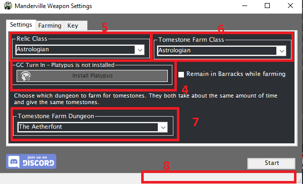

# Manderville Relic Weapons

[![Discord][3]][4]
[](https://github.com/sponsors/domesticwarlord86)
[![Donate][5]][6]

This plugin is designed to obtain your level 90 Manderville weapon with as little interaction from the user as possible. Information on these weapons can be found here: [FFXIV Console Games Wiki](https://ffxiv.consolegameswiki.com/wiki/Manderville_Weapons)

This plugin will also run the Hildibrand quest line to unlock the reic weapoons. It's quite a fun quest line, so you may want to do it manually. If not, this will take care of it. There will be three manual steps in the unlock quests, the level 70 Duty "Kugane Ohashi" and two zoomie-zoom quests.

This plugin updates on restart of RebornBuddy and doesn't need to be added to repoBuddy.
## Requirements

- [RebornBuddy][7] with active license (paid)
- [Lisbeth][9] with active license (paid)
- [LlamaLibrary][10] (free)
- [LlamaUtilities](https://github.com/nt153133/LlamaUtilities) (free)
- [RBTrust](https://github.com/LlamaMagic/RBtrust) (free)
- [Osiris](https://github.com/domesticwarlord86/PandaPlugins) (free)

## Installation

1. Download the latest version by following the link [here](https://sts.llamamagic.net/MandervilleWeapons/MandervilleWeapons.zip).
2. On the `.zip` file, right click > `Properties` > `Unblock` > `Apply`.
3. Unzip all contents into `RebornBuddy\Plugins\` so it looks like this:

```
RebornBuddy
└── Plugins
    └── MandervilleWeapons
        ├── OrderBot Tags
        ├── MandervilleWeaponsLoader.cs
        ├── MandervilleWeaponsSettings.cs
        ├── Version.txt
        └── MandervilleWeapons.dll
```

## Current Progress

### Manderville Weapons (iLvl 615)
- [x] Make It a Manderville
- [x] Make Another Manderville

### Amazing Manderville Weapons (iLvl 630)
- [x] Well-oiled
- [x] The Next Mander-level

## Usage

1. Click the Plugins tab in the RebornBuddy window
2. Select Manderville Weapons from the Plugin list
    * You may notice that Enabling the Manderville Weapons plugin gives you two quick references buttons on your main RB window.
3. Click Settings

4. GC Turn In settings
    * `Enabled` - Turn this on if you'd like the bot to turn in gear in your inventory for Grand Company seals. It will turn in any item in your inventory that is eligible. Inventory ONLY, not armory or anything else.
    * `Turn In Every Run?` & `Free Slots` - Assuming you enabled GC Turn In, would you like it to turn in after every run, or at a set amount of free inventory slots. One or the other, not both. If `Turn In Every Run` is checked, Free Slots is ignored.
    * `Buy Item Enabled`, `Seals To Buy`, `GC Item` & `Qty` - If you turn on GC Turn In you're going to cap out on seals while running this. Capping out on seals will cause GC Turn In to break and stop the bot. To prevent that, you'll want to buy items to keep it from capping out. Enable this feature by checking `Buy Item Enabled` then select what item you want to buy in the drop down, and set how many you want to buy in `Qty` (Setting 999 will cause it to buy as many as you can afford). `Seals to buy` controls when GC Buy Item is triggered. I set it to about 20k from my cap, so that I never risk hitting the cap
5. Relic Class settings
    * `Relic Class?` - This is what classes's relic you are after.
    * `Go To Barracks` - This will have your character go to your Grand Company's Barrack chamber between dungeon runs.
6. Troia Farm Class
    * Choose which class you want to run `The Fell Court of Troia` on. As mentioned below, I recommend a tank.
7. Here you will see your current farming status. It updates every 30 seconds and acts as a good 'at a glance' feature to let you know what the bot is doing.
8. Once you have the settings the way you like, hit Start.



## Notes
### Start

- When running this Plugin you must use either the Start button inside the plugin settings, or the Manderville Start button that gets added to your main RB window. Because of the way the plugin works, hitting the Main RB Start button will error.
### The Fell Court of Troia

- We run the level 90 dungeon `The Fell Court of Troia` for Allagan Tomestone of Astronomy that are needed for each stage of this relic quest line. The duty support NPCs aren't all that smart here and tend to get themselves killed here which will cause a wipe. Howevere, tank jobs are able to power through it, yay tank privilege. Imo Paladin is the best, but I've heard success stories from any of the tank jobs.

### Farming

- I also included a section to allow for farming of Meteorites or Chonrites without upgrading and interfacing with the quest. This is useful for people who would prefer to farm up all the mats and then turn them in all at once rather than working on one relic at a time. It is not necessary to use this top, but it's an option for people who want to.

### Key Tab


This tab is pretty straight forward. When you purchase the plugin you'll get a key sent to the email used when making the purchase. Take that key, put it in the box, hit `Verify`. That'll enable the plugin. Job done.

## Known Issues

- None at this time


[3]: https://img.shields.io/badge/Discord-7389D8?logo=discord&logoColor=ffffff&labelColor=6A7EC2
[4]: https://discord.gg/CucSWEhJSZ "Discord"
[5]: https://shields.io/badge/-Buy%20me%20a%20coffee-FF5E5B?logo=kofi&logoColor=ffffff&labelColor=FF5E5B
[6]: https://ko-fi.com/domesticwarlord86 "Donate via Ko-Fi"
[7]: https://www.rebornbuddy.com/ "RebornBuddy"
[8]: https://github.com/LlamaMagic/ExBuddy "ExBuddy"
[9]: https://www.siune.io/ "Lisbeth"
[10]: https://github.com/nt153133/__LlamaLibrary "LlamaLibrary"
[11]: https://discord.gg/rDsFbKr "Magitek Discord"
[12]: https://github.com/Zimgineering/repoBuddy "RepoBuddy"