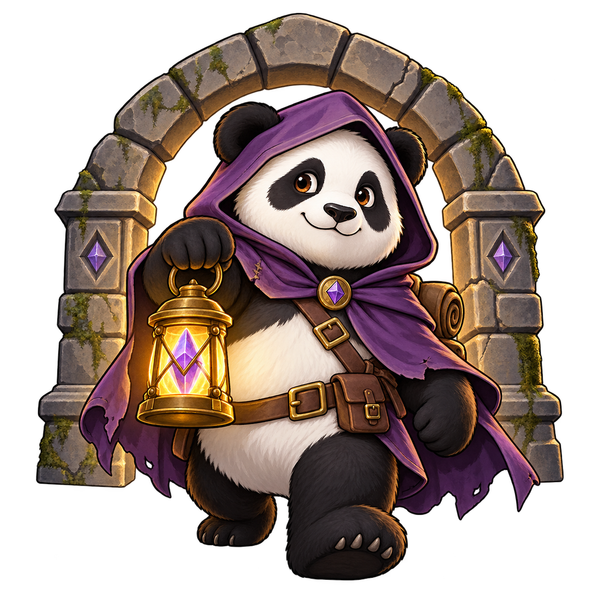

<!-- Updated for published 0.8.0.2 on 2026-10-01 using Crucible Distribution.md,
     HANDOFF.md and the shipped workflow contracts. Retain the existing product URL
     for incoming links; installation and navigation now identify a botbase.
     Do not advertise later local-only overlay changes as released features. -->

<section class="tt-hero">
  

    

      Beastmaster automation · Beta
      

        <!-- Chris supplied this Crucible-specific artwork to replace the shared Panda branding. -->
        
        <h1>Panda Crucible</h1>
      

      
Build your team. Choose your board. Keep progressing. Panda Crucible brings board runs, pet training, and Beastmaster progression together in one standalone RebornBuddy botbase.

      

        <a class="tt-button tt-button--primary" href="https://buy.stripe.com/8x29ATegE5fefpEetfcjS0N">Buy Panda Crucible — US$20</a>
        <a class="tt-button" href="https://downloads.llamamagic.net/plugins/PandaCrucible/PandaCrucible.zip">Download beta</a>
        <a class="tt-button" href="readme/">Setup &amp; customer guide</a>
      

      
Board completionSelective pet levelingBuilt-in combat routine

    

    

      One botbase. Three ways forward.
      <h2>Give every run a purpose.</h2>
      
01
<h3>Run a board</h3>
Choose Completion or High Score on supported boards, with repeat controls for your next session.

      
02
<h3>Train your pets</h3>
Select the pets and boards you want to use. Leveling follows their permanent ranks and advances through enabled stages.

      
03
<h3>Follow progression</h3>
Work through supported unlock quests, prerequisite boards, and permanent gear and pet purchases.

    

  

</section>

<section class="tt-section">
  
<strong>Beta access:</strong> Panda Crucible is <strong>US$20 one-time</strong> and requires its own product key. <a href="https://buy.stripe.com/8x29ATegE5fefpEetfcjS0N">Purchase through Stripe Checkout</a>. Visit <a href="https://discord.gg/CucSWEhJSZ">Discord</a> for access and setup help. Encounter reliability is still being improved.

</section>

<section class="tt-section">
  
From entry to rewards<h2>Less setup between runs.</h2>
Choose the objective in the launcher and let Crucible coordinate the team, route, combat, and rewards.

  

    <article class="tt-feature">01<h3>Complete board routes</h3>
Run all five boards with route selection and repeat settings. Second Master's Board remains an opt-in beta route. The controller handles board travel, supplies, battles, and reward collection.
</article>
    <article class="tt-feature">02<h3>Selective pet training</h3>
Enable individual owned pets and choose which boards to train on. Permanent pet levels determine when the route can move to the next enabled stage.
</article>
    <article class="tt-feature">03<h3>Beastmaster progression</h3>
Connect supported quests and prerequisite clears with permanent upgrades. Verified checkpoints track clears, quests, core-pet training, and equipment. Farming phases use your highest successfully cleared board.
</article>
    <article class="tt-feature">04<h3>Dedicated combat</h3>
Bundled Beastmaster combat and encounter controllers handle board mechanics and movement. No separate DutyMechanic installation is required. Cu Sith, Chimera, and Behemoth are the only supported combat team on every board. Missing these pets? Crucible will unlock them for you through Progression.
</article>
    <article class="tt-feature">05<h3>Between-run maintenance</h3>
Automatically repair equipped gear before entry when it falls below your chosen condition threshold. Choose whether a failed board should retry or stop.
</article>
    <article class="tt-feature">06<h3>Progress at a glance</h3>
Follow the current run through the compact game overlay and request a deferred stop. Active-board recovery can resume supported Standard boards after you reconnect and press Start.
</article>
  

</section>

<section class="tt-section">
  
Before your first run<h2>Start with the right setup.</h2>

  

    
<h3>Requirements</h3><ul class="tt-checklist">
      <li>FINAL FANTASY XIV for Windows with the required Beastmaster content unlocked; Global support and provisional CN compatibility</li>
      <li>A compatible .NET 10 <a href="https://www.rebornbuddy.com/">RebornBuddy</a> installation and active license</li>
      <li>Current <a href="https://github.com/nt153133/__LlamaLibrary">LlamaLibrary</a> and <a href="https://github.com/nt153133/LlamaUtilities">LlamaUtilities</a></li>
      <li>A valid Panda Crucible product key</li>
      <li>Cu Sith, Chimera, and Behemoth are the only supported combat team. If you do not own them yet, choose Progression to unlock them.</li>
    </ul>

    
<h3>Install, activate, choose a goal</h3><ol>
      <li>Close all RebornBuddy instances sharing the installation, remove old Crucible plugin/routine copies, and extract into <code>BotBases\PandaCrucible\</code>. Keep <code>Settings</code>.</li>
      <li>Restart RebornBuddy, select Panda Crucible in the botbase list, and open its settings.</li>
      <li>Verify your key, choose Progression, Farming, High Score, or Pet leveling, and press Start in Crucible or RebornBuddy.</li>
    </ol>
Panda Farmer and Magitek are not required. The <a href="readme/">customer guide</a> covers dependencies, upgrading older installations, and settings.

  

</section>

<section class="tt-section">
  
Know what to expect<h2>Built for progress. Still in beta.</h2>

  

    

Which boards are available?

All five boards support Completion, Pet leveling, and High Score attempts. Second Master's Board remains an optional beta route with a level 25 training target; its High Score mode is for trials, and consistent Legendary results are not established. Use Cu Sith, Chimera, and Behemoth and monitor initial runs.

    

How does pet leveling advance?

First Board trains to level 5, Second to 10, Third to 15, and First Master to 20. All enabled pets must reach a stage's cap before advancing, and disabled boards are skipped. Keep farming lets you continue on the last enabled board after its cap.

    

Can I leave every board unattended?

Reliable unattended completion of every encounter has not been established. Watch initial runs, especially on later boards, and report problems with the board, goal, and RebornBuddy log on Discord.

    

Does it support every regional client?

Global is the primary validated client. CN compatibility is provisional and still needs separate mechanic validation. Traditional Chinese does not yet have this content. The interface supports English, Japanese, German, French, and Simplified Chinese.

    

Do I need a separate combat routine?

No. Crucible includes Beastmaster combat and board encounters. It disables DutyMechanic at startup to prevent competing movement and leaves it disabled after stopping. If an older handler remains loaded, restart RebornBuddy with DutyMechanic disabled.

  

</section>

<section class="tt-section">
  

Ready for your next board?<h2>Choose your goal. Bring your team.</h2>
Check beta access, follow the setup guide, and start with a board your character is ready for.

<a class="tt-button tt-button--primary" href="https://buy.stripe.com/8x29ATegE5fefpEetfcjS0N">Buy Panda Crucible</a><a class="tt-button" href="readme/">Read the customer guide</a><a class="tt-button" href="https://discord.gg/CucSWEhJSZ">Get help on Discord</a>

  
FINAL FANTASY XIV is a registered trademark of Square Enix Holdings Co., Ltd. Panda Crucible is a third-party RebornBuddy botbase and is not affiliated with or endorsed by Square Enix.

</section>

