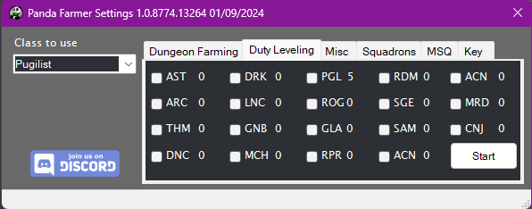
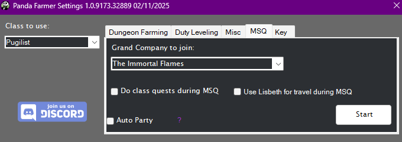

# Panda Farmer

[![Discord][3]][4]
[](https://github.com/sponsors/domesticwarlord86)
[![Donate][5]][6]

This plugin is intended to be a replacement for my sponsor repo. It included farming for every dungeon I have available as well as the 1-90 leveling suite using those dungeons.

 
## Requirements

- [RebornBuddy][7] with active license (paid)
- [Lisbeth][9] with active license (paid)
- [LlamaLibrary][10] (free)
- [LlamaUtilities](https://github.com/nt153133/LlamaUtilities) (free)
- [Platypus](https://rbplatypus.com/) (free+)
- [Osiris](https://github.com/domesticwarlord86/PandaPlugins) (free)

## Purchasing

You can request a 72 hour trial of any of my plugins by joining our [![Discord][3]][4] and typing `/trial` on the #bot-spam channel.

If you're happy with the plugin and would like to purchase it, you can do so over at the [Purchase](../../purchase/DW/purchase.md) page. PandaFarmer is subscription based, but there's also an option to just purchase a 30 day key.

## Installation

1. Download the latest version by following the link [here](https://sts.llamamagic.net/PandaFarmer/PandaFarmer.zip).
2. On the `.zip` file, right click > `Properties` > `Unblock` > `Apply`.
3. Unzip all contents into `RebornBuddy\Plugins\ ` so it looks like this:

```
RebornBuddy
└── Plugins
    └── PandaFarmer
        ├── PandaFarmerLoader.cs
        ├── Version.txt
        ├── LlamaAuth.dll
        └── PandaFarmer.dll
```
## Dungeon Farming
{.center .xsmall}

This is the main tab of Panda Farmer and as the plugin's name insinuates you'll use it for farming dungeons. You select the class you want to use on the far left side, the dungeon you want to do on the left of the tab, and how you want to queue it on the right. Choose whether you'd like to go to your GC Barracks between runs, and if you'd like to turn in items after every run. You can click the Platypus icon to open's Platypus' settings. Once done, hit start and the bot will start it's work.

Some of the dungeons perform better with the bot than others. In general the ones used for farming I spend more time on getting perfected. The ones that are generally only completed once for MSQ are likely just "good enough." Meaning they may die a few times but will eventually complete the dungeon.

As some of these profiles have more effort put into them versus the others I've started using a star system that will display to tell you the quality of the profiles.

- ★★★★★ - Five star profiles are the best of the best. These profiles I would trust to run AFK and even in a group of live people.
- ★★★★☆ - Four star profiles have a lot of effort into them. These profiles have working mechanics for most boss fights and will work well with NPCs. I would not recommend using them in a live party.
- ★★★☆☆ - Three star profiles are "good enough." These are profiles that I put enough effort into them so that you can use them to complete MSQ at least once, and then basically abandon. You can usually farm these reliably as long as you do them unrestricted.
- ★★☆☆☆ - Two star profiles are good enough to be used unrestricted, but likely have no custom programming for boss mechanics. As long as you're max level though you should be able to farm them relatively well.
- ★☆☆☆☆ - One star profiles are profiles that work... sometimes. They've got glaring issues that I either can't, or haven't fixed and are usually only used when you really don't want to do the duty yourself but don't mind dying a million times.

[Platypus](https://rbplatypus.com/) is required for the profiles to run. You don't have to use it, but it needs to be installed. If you're seeing the `Install Platypus` button, click it and it'll install. (It may get hung trying to restart RebornBuddy. Just close RB and open it back and you should be good.)

## Duty leveling
{.center .xsmall}

This tab is used for leveling various jobs. Select the jobs you wish to level and hit Start. It'll unlock jobs that haven't been unlocked yet. It'll do class quests along the way. It will respect the `Go To Barracks` and `Turn In Every Run` settings from Dungeon Farming tab. The Duty Leveling tab will update with levels and classes as your character goes along to give you an at-a-glance idea of your leveling status. When the bot stops you'll get a print out in RebornBuddy's log showing you the levels gained during this session.

For information purposes it uses these dungeons:

??? note "Dungeons"
    - 1-15 Using Hunting Logs and Class quests    
    - 15-16 Sastasha
    - 16-17 Tam-Tara Deepcroft
    - 17-24 The Copperbell Mines
    - 24-32 The Thousand Maws of Tot-Rak
    - ~~28-32 Haukke Manor~~ (There's a targetting issue with Magitek that causes this dungeon to get stuck a lot, removing until it can be fixed.)
    - 32-41 Brayflox's Longstop
    - 41-50 The Stone Vigil
    - 50-53 Keeper of the Lake
    - 53-55 Sohm Al
    - 55-57 The Aery
    - 57-59 The Vault
    - 59-61 The Great Gubal Library
    - 61-67 The Sirensong Sea
    - 67-71 Doma Castle
    - 71-73 Holminster Switch
    - 73-75 Dohn Mheg
    - 75-77 The Qitana Ravel
    - 77-79 Malikah's Well
    - 79-81 Mt. Gulg
    - 81-83 The Tower of Zot
    - 83-87 The Tower of Babil
    - 87-90 Ktisis Hyperboreia


## Misc
{.center .xsmall}

Here you can find multiple profiles that do various things. This tab respects the Class to Use box as well as the Go To Barracks and GC Turn in settings of Dungeon Farming, if they're relevant to the particular profile being ran.

### Achievements

- [But Somebody's Gotta Do It](https://ffxiv.gamerescape.com/wiki/But_Somebody%27s_Gotta_Do_It) - Farms Garuda EX for this achievement. For DRK, PLD, and WAR 2.x/3.x war-animal achievement mounts.
- [Tank You, <Class> III](https://ffxiv.gamerescape.com/?search=Tank+You+III&title=Special%3ASearch) - Farms Sirensong Sea for DRK, GNB, PLD, and WAR 4.x/5.x battle-animal achievement mounts. (Note there is a 100 duty limit per day imposed by the game. If you're running this continually back to back you will hit the limit and won't be able to queue until the daily reset.)
- [All The More Region To Leve VI](hhttps://na.finalfantasyxiv.com/lodestone/playguide/db/achievement/7a22e46cfae/) - This profile will farm Leves on Whitebrim over and over until you run out of Leve allowances. Used to gain the title Lord/Lady Protector.
- [Straight B's](https://na.finalfantasyxiv.com/lodestone/playguide/db/achievement/23b97738283/) - This profile will farm B rank hunt mobs to complete this achievement.

### AutoParty

This is designed to be a power leveling tool for people who are leveling alts on a second account. You start AutoParty on your high level character and it will wait for a party invite, once getting the party invite it will wait for a dungeon queue, join the dungeon, and then load the profile for the dungeon. Effectively getting your lower level character an automatic power level for the dungeons the bot can't do automatically.

To use this feature follow these steps:

1. On your low level character in the MSQ tab of Panda Farmer check the box for `Use AutoParty` and enter the name of your high level character in the text box that appears. (Alternatively you can send the party invite yourself but it won't be automated without the name.)
1. On your high level character make sure you're on the same server as your low level character, open Panda Farmer > Misc > AutoParty and hit Start. Your character will teleport to Aelport and you will see ` [AutoParty] Waiting on party invite...` in the log of RB, that's when you know it's ready.
2. On your low level character start running the MSQ profile. When the profile gets to a point that it can use the AutoParty carry it will teleport to Aelport and invite your carry character. (Alternatively you can send the party invite yourself.)
3. AutoParty will automatically accept the party invite.
4. If you're not using the MSQ profile, on your low level character select the Duty that needs to be done in Duty Finder and make sure to queue as Unrestricted Party.
5. Once inside the dungeon, AutoParty will automatically load the profile for that zone and complete the dungeon. Once done, AutoParty will leave the dungeon and wait for the next dungeon to pop.

### Grand Company Rank Up

This profile will rank you Grand Company up to Second Lieutenant which is where you obtain your squadrons. Those can't be done by the bot. It will use Expert Turn ins to farm seals, using an appropriate level dungeon to farm dungeon gear to turn in. It will respect the `Go To Barracks` setting from Dungeon Farming tab. While you can do this at lower levels, I don't recommend doing it any lower than 60 as you have to do `The Aurum Vale` and `Dzemael Darkhold` for the GC quests in order to rank up and these dungeons are 47 and 50 respectively. They do not have Duty Support, so the profile can only attempt them unrestricted.

For information purposes it uses these dungeons:

??? note "Dungeons"
    - Character Level 90: The Sirengsong Sea (Unrestricted)   
    - Character Level 80-89: Sohm Al (Unrestricted)   
    - Character Level 60-79: The Sirengsong Sea (Duty Support)  
    - Character Level 50-59: The Keeper of the Lake (Duty Support)  
    - Character Level 41-49: The Stone Vigil (Duty Support) 
    - Character Level 32-40: Brayfloxs Longstop (Duty Support) 
    - Character Level 28-31: Haukke Manor (Duty Support) 
    - Character Level 24-27: The Thousand Maws of Toto-Rak (Duty Support) 
    - Character Level 17-23: The Copperbell Mines (Duty Support) 
    - Character Level 16: The Tam-Tara Deepcroft (Duty Support) 
    - Character Level 15: Saastasha (Duty Support) 

### Unlock Classes

These profiles will go and unlock the classes for each of the various expansions. Good for when you want to level a class with Duty Leveling.

### Current Class Quests

This profile will go and do the class quests for whatever job you set on the job select drop down.

### Side Quests

These profiles will complete the available side quests in each specific region. I eventually intend to have all regions covered, but it's slow going.

Currently available: `La Noscea` `Thanalan`

### Guildheist

This profile will farm the Guildheist `Under The Armor` to allow to complete the guildheist achievements. It does NOT do the guildheists prior to this one, so it much already be unlocked.


## Squadrons

This tab contains a selection menu for you to be able to run Command Missions with your Grand Company squadron. Information on Command Missions can be found here: [FFXIV Console Games Wiki](https://ffxiv.consolegameswiki.com/wiki/Command_Missions)

For information purposes it uses these dungeons:

??? note "Dungeons"
    - Halatali
    - The Thousand Maws of Toto-Rak
    - Brayflox's Longstop
    - The Stone Vigil
    - The Aurum Vale
    - The Wanderer's Palace
    - Pharos Sirius
    - The Vault   

## MSQ
{.center .xsmall}

This tab does the Main Story Quest for the game. It is a replacement to my sponsored MSQ repo. The MSQ section of Panda Farmer is included with a monthly subscription of Panda Farmer, but for those who purchased the One-Time purchase sponsor github repo there's an optional check box in the Key tab of Panda Farmer to provide a MSQ only key. You can contact me to obtain a key if you've already paid for the repo. This will permanently unlock ONLY the MSQ section of Panda Farmer.

If you are starting the MSQ process on a character that has yet to choose a Grand Company you have the option to choose which Grand Company the profile joins.

It will do the following:

- Complete all Main Story Quests from each expansion, A Realm Reborn (2.x), Heavensward (3.x), Stormblood (4.x), Shadowbringers (5.x), and Endwalker (6.x).
- Complete (most) MSQ Dungeons using the Duty Support system in FFXIV.
- Do class quests for your selected class at intervals along the way.
- Unlocks flight support for each zone as MSQ progress allows.

There are some manual steps along the way however, most of them will be duties that aren't supported by the Duty Support system or solo duties that are too complicated for the bot to do itself. The bot will stop and pop up a message to let you know when a manual step is needed.
Here is a list of the manual steps:
??? note "Manual MSQ Steps"
    ### 2.x: A Realm Reborn Manual Steps
    - Quest `Lv. 50: You Have Selected Regicide` requires the 8-player trial `Lv. 50: Thornmarch (Hard)`.
    - Quest `Lv. 50: Lord of the Whorl` requires the 8-player trial `Lv. 50: The Whorleater (Hard)`.
    - Quest `Lv. 50: Levin an Impression` requires the 8-player trial `Lv. 50: The Striking Tree (Hard)`.
    - Quest `Lv. 50: The Instruments of Our Deliverance` requires the 8-player trial `Lv. 50: Akh Afah Amphitheater (Hard)`.
    - Quest `Lv. 50: Ifrit Bleeds, We Can Kill It` requires the 8-player trial `Lv. 50: The Bowl of Embers (Hard)`.
    - Quest `Lv. 50: In For Garuda Awakening` requires the 8-player trial `Lv. 50: The Howling Eye (Hard)`.
    - Quest `Lv. 50: In a Titan Spot` requires the 8-player trial `Lv. 50: The Navel (Hard)`.
    - Quest `Lv. 50: An Uninvited Ascian` requires the 8-player trial `Lv. 50: The Chrysalis`.
    - Quest `Lv. 50: The Steps of Faith` requires a solo duty.
    - Quest `Lv. 50: The Labyrinth of the Ancients` requires the 24-player raid `Lv. 50: Labyrinth of the Ancients`.
    - Quest `Lv. 50: Syrcus Tower` requires the 24-player raid `Lv. 50: Syrcus Tower`.
    - Quest `Lv. 50: The World of Darkness` requires the 24-player raid `Lv. 50: The World of Darkness`.

    ### 3.x: Heavensward Manual Steps

    -   Quest `Lv. 53: Lord of the Hive` requires the 8-player trial `Lv. 53: Thok ast Thok (Hard)`.
    -   Quest `Lv. 57: Bolt, Chain, and Island` requires the 8-player trial `Lv. 57: The Limitless Blue (Hard)`.
    -   Quest `Lv. 60: Heavensward` requires the 8-player trial `Lv. 60: The Singularity Reactor`.
    -   Quest `Lv. 60: An End to the Song` requires the 8-player trial `Lv. 60: The Final Steps of Faith`.
    -   Quest `Lv. 60: The Beast That Mourned at the Heart of the Mountain` requires the 8-player trial `Lv. 50: The Navel (Hard)`.
    -   Quest `Lv. 60: Fly Free, My Pretty` requires a solo duty.

    ### 4.x: Stormblood Manual Steps

    -   Quest `Lv. 61: It's Probably a Trap` requires a solo duty.
    -   Quest `Lv. 63: The Lord of the Revel` requires the 8-player trial `Lv. 63: The Pool of Tribute`.
    -   ~~Quest `Lv. 64: A New Ruby Tithe` requires three zoomie-zooms.~~
    -   Quest `Lv. 65: In the Footsteps of Bardam the Brave` requires the 4-player dungeon `Lv. 65: Bardam's Mettle`.
    -   ~~Quest `Lv. 66: The Labors of Magnai` requires manually gathering underwater Swordgrass.~~
    -   Quest `Lv. 66: Naadam` requires a solo duty.
    -   ~~Quest `Lv. 67: The Die Is Cast` requires the 4-player dungeon `Lv. 67: Doma Castle`.~~
    -   Quest `Lv. 67: The Lady of Bliss` requires the 8-player trial `Lv. 67: Emanation`.
    -   ~~Quest `Lv. 69: The Price of Freedom` requires the 4-player dungeon `Lv. 69: Castrum Abania`.~~
    -   Quest `Lv. 69: The Key to Victory` requires a solo duty.
    -   Quest `Lv. 69: The Resonant` requires a solo duty.
    -   ~~Quest `Lv. 70: Stormblood` requires the 4-player dungeon `Lv. 70: Ala Mhigo`.~~
    -   Quest `Lv. 70: Stormblood` requires the 8-player trial `Lv. 70: The Royal Menagerie`.
    -   Quest `Lv. 70: The Mad King's Trove` requires swimming underwater to unlock the dungeon.
    -   ~~Quest `Lv. 70: The Mad King's Trove` requires the 4-player dungeon `Lv. 70: The Drowned City of Skalla`.~~
    -   ~~Quest `Lv. 70: Securing the Saltery` requires two zoomie-zooms.~~
    -   Quest `Lv. 70: Return of the Bull` requires a solo duty.
    -   Quest `Lv. 70: Hope on the Waves` requires a solo duty.
    -   Quest `Lv. 70: The Primary Agreement` requires the 8-player trial `Lv. 70: Castrum Fluminis`.
    -   Quest `Lv. 70: Emissary of the Dawn` requires a solo duty.
    -   ~~Quest `Lv. 70: Feel the Burn` requires the 4-player dungeon `Lv. 70: The Burn`.~~
    -   Quest `Lv. 70: The Will of the Moon` requires a solo duty.
    -   ~~Quest `Lv. 70: The Face of War` requires the 4-player dungeon `Lv. 70: The Ghimlyt Dark`.~~
    -   Quest `Lv. 70: A Requiem for Heroes` requires a solo duty.

    ### 5.x: Shadowbringers Manual Steps

    -   Quest `Lv. 70: A Fickle Existence` requires a zoomie-zoom.
    -   Quest `Lv. 70: City of the Mord` requires a zoomie-zoom.
    -   Quest `Lv. 73: Acht-la Ormh Inn` requires the 8-player trial `Lv. 73: The Dancing Plague`.
    -   Quest `Lv. 74: A Little Faith` requires a zoomie-zoom.
    -   Quest `Lv. 74: A Beeautiful Plan` requires a zoomie-zoom.
    -   Quest `Lv. 77: Full Steam Ahead` requires a solo duty.
    -   Quest `Lv. 78: The View from Above` requires a zoomie-zoom.
    -   Quest `Lv. 78: Meet the Tholls` requires two zoomie-zooms.
    -   Quest `Lv. 79: Extinguishing the Last Light` requires the 8-player trial `Lv. 79: The Crown of the Immaculate`.
    -   Quest `Lv. 79: City of the Ancients` requires a zoomie-zoom.
    -   Quest `Lv. 80: Shadowbringers` requires the 4-player dungeon `Lv. 80: Amaurot`.
    -   Quest `Lv. 80: Shadowbringers` requires the 8-player trial `Lv. 80: The Dying Gasp`.
    -   Quest `Lv. 80: A Grand Adventure` requires the 4-player dungeon `Lv. 80: The Grand Cosmos`.
    -   Quest `Lv. 80: Finding Good Help` requires a zoomie-zoom.
    -   Quest `Lv. 80: Vows of Virtue, Deeds of Cruelty` requires a solo duty.
    -   Quest `Lv. 80: The Converging Light` requires the 4-player dungeon `Lv. 80: The Heroes' Gauntlet`.
    -   Quest `Lv. 80: Hope's Confluence` requires the 8-player trial `Lv. 80: The Seat of Sacrifice`.
    -   Quest `Lv. 80: Like Master, Like Pupil` requires the 4-player dungeon `Lv. 80: Matoya's Relict`.
    -   Quest `Lv. 80: The Great Ship Vylbrand` requires a solo duty.
    -   Quest `Lv. 80: The Flames of War` requires the 4-player dungeon `Lv. 80: Paglth'an`.
    -   Quest `Lv. 80: Death Unto Dawn` requires a solo duty.

    ### 6.x: Endwalker Manual Steps

    -   Quest `Lv. 80: Deeper into the Maze` requires a zoomie-zoom.
    -   Quest `Lv. 82: A Frosty Reception` requires a partial solo duty.
    -   Quest `Lv. 83: In from the Cold` requires a solo duty.
    -   Quest `Lv. 83: The Martyr` requires the 8-player trial `Lv. 83: The Dark Inside`.
    -   Quest `Lv. 84: Setting Things Straight` requires a zoomie-zoom.
    -   Quest `Lv. 88: As the Heavens Burn` requires a solo duty.
    -   Quest `Lv. 88: Wise Guides` requires a zoomie-zoom.
    -   Quest `Lv. 89: Her Children, One and All` requires the 4-player dungeon `Lv. 89: The Aitiascope Inside`.
    -   Quest `Lv. 89: Her Children, One and All` requires the 8-player trial `Lv. 89: The Mothercrystal`.
    -   Quest `Lv. 90: ┣┨̈//̈ No┨ΦounΔ•••` requires a zoomie-zoom.
    -   Quest `Lv. 90: Hello, World` requires a zoomie-zoom.
    -   ~~Quest `Lv. 90: Endwalker` requires the 4-player dungeon `Lv. 90: The Dead Ends`.~~
    -   Quest `Lv. 90: Endwalker` requires the 8-player trial `Lv. 90: The Final Day`.
    -   Quest `Lv. 90: Endwalker` requires a solo duty.
    -   Quest `Lv. 90: Alzadaal's Legacy` requires the 4-player dungeon `Lv. 90: Alzadaal's Legacy`.
    -   ~~Quest `Lv. 90: In Search of Azdaja` requires the 4-player dungeon `Lv. 90: The Fell Court of Troia`.~~
    -   Quest `Lv. 90: The Wind Rises` requires the 8-player trial `Lv. 90: The Storm's Crown`.

[3]: https://img.shields.io/badge/Discord-7389D8?logo=discord&logoColor=ffffff&labelColor=6A7EC2
[4]: https://discord.gg/CucSWEhJSZ "Discord"
[5]: https://shields.io/badge/-Buy%20me%20a%20coffee-FF5E5B?logo=kofi&logoColor=ffffff&labelColor=FF5E5B
[6]: https://ko-fi.com/domesticwarlord86 "Donate via Ko-Fi"
[7]: https://www.rebornbuddy.com/ "RebornBuddy"
[8]: https://github.com/LlamaMagic/ExBuddy "ExBuddy"
[9]: https://www.siune.io/ "Lisbeth"
[10]: https://github.com/nt153133/__LlamaLibrary "LlamaLibrary"
[11]: https://discord.gg/rDsFbKr "Magitek Discord"
[12]: https://github.com/Zimgineering/repoBuddy "RepoBuddy"