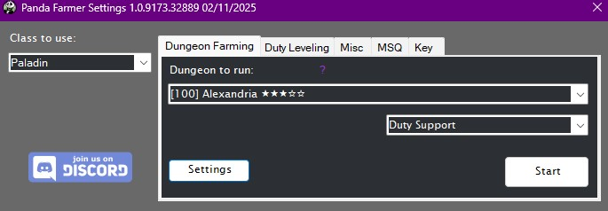

# Panda Farmer

[![Discord][3]][4]
[](https://github.com/sponsors/domesticwarlord86)
[![Donate][5]][6]

This plugin is intended to be a replacement for my sponsor repo. It included farming for every dungeon I have available as well as the 1-90 leveling suite using those dungeons.

 
## Requirements

- [RebornBuddy][7] with active license (paid)
- [Lisbeth][9] with active license (paid)
- [LlamaLibrary][10] (free)
- [LlamaUtilities](https://github.com/nt153133/LlamaUtilities) (free)
- [Platypus](https://rbplatypus.com/) (free+)
- [Osiris](https://github.com/domesticwarlord86/PandaPlugins) (free)

## Purchasing

You can request a 72 hour trial of any of my plugins by joining our [![Discord][3]][4] and typing `/trial` on the #bot-spam channel.

If you're happy with the plugin and would like to purchase it, you can do so over at the [Purchase](../../purchase/DW/purchase.md) page. PandaFarmer is subscription based, but there's also an option to just purchase a 30 day key.

## Installation

1. Download the latest version by following the link [here](https://sts.llamamagic.net/PandaFarmer/PandaFarmer.zip).
2. On the `.zip` file, right click > `Properties` > `Unblock` > `Apply`.
3. Unzip all contents into `RebornBuddy\Plugins\ ` so it looks like this:

```
RebornBuddy
└── Plugins
    └── PandaFarmer
        ├── PandaFarmerLoader.cs
        ├── Version.txt
        ├── LlamaAuth.dll
        └── PandaFarmer.dll
```
## Dungeon Farming
{.center .xsmall}

This is the main tab of Panda Farmer and as the plugin's name insinuates you'll use it for farming dungeons. You select the class you want to use on the far left side, the dungeon you want to do on the left of the tab, and how you want to queue it on the right. Choose whether you'd like to go to your GC Barracks between runs, and if you'd like to turn in items after every run. You can click the Platypus icon to open's Platypus' settings. Once done, hit start and the bot will start it's work.

[Platypus](https://rbplatypus.com/) is required for the profiles to run. You don't have to use it, but it needs to be installed. If you're seeing the `Install Platypus` button, click it and it'll install. (It may get hung trying to restart RebornBuddy. Just close RB and open it back and you should be good.)

## Misc
{.center .xsmall}

Here you can find multiple profiles that do various things. This tab respects the Class to Use box as well as the Go To Barracks and GC Turn in settings of Dungeon Farming, if they're relevant to the particular profile being ran.

### Achievements

- But Somebody's Gotta Do It
    * [But Somebody's Gotta Do It](https://ffxiv.gamerescape.com/wiki/But_Somebody%27s_Gotta_Do_It) - Farms Garuda EX for this achievement. For DRK, PLD, and WAR 2.x/3.x war-animal achievement mounts.
    * [Tank You, <Class> III](https://ffxiv.gamerescape.com/?search=Tank+You+III&title=Special%3ASearch) - Farms Sirensong Sea for DRK, GNB, PLD, and WAR 4.x/5.x battle-animal achievement mounts.

### Duty Leveling

This profile will level the selected job from 1-90 using Duty Support to spam dungeons and gain experience. It'll do class quests along the way. It will respect the `Go To Barracks` and `Turn In Every Run` settings from Dungeon Farming tab. There's no way to set it so it levels multiple classes. One at a time! Select your class and hit start.

For information purposes it uses these dungeons:

??? note "Dungeons"
    - 1-15 Using Hunting Logs and Class quests    
    - 15-16 Sastasha
    - 16-17 Tam-Tara Deepcroft
    - 17-24 The Copperbell Mines
    - 24-28 The Thousand Maws of Tot-Rak
    - 28-32 Haukke Manor
    - 32-41 Brayflox's Longstop
    - 41-50 The Stone Vigil
    - 50-53 Keeper of the Lake
    - 53-55 Sohm Al
    - 55-57 The Aery
    - 57-59 The Vault
    - 59-61 The Great Gubal Library
    - 61-67 The Sirensong Sea
    - 67-71 Doma Castle
    - 71-73 Holminster Switch
    - 73-75 Dohn Mheg
    - 75-77 The Qitana Ravel
    - 77-79 Malikah's Well
    - 79-81 Mt. Gulg
    - 81-83 The Tower of Zot
    - 83-87 The Tower of Babil
    - 87-90 Ktisis Hyperboreia

### Grand Company Rank Up

This profile will rank you Grand Company up to Second Lieutenant which is where you obtain your squadrons. Those can't be done by the bot. It will use Expert Turn ins to farm seals, using an appropriate level dungeon to farm dungeon gear to turn in. It will respect the `Go To Barracks` setting from Dungeon Farming tab. While you can do this at lower levels, I don't recommend doing it any lower than 60 as you have to do `The Aurum Vale` and `Dzemael Darkhold` for the GC quests in order to rank up and these dungeons are 47 and 50 respectively. They do not have Duty Support, so the profile can only attempt them unrestricted.

For information purposes it uses these dungeons:

??? note "Dungeons"
    - Character Level 90: The Sirengsong Sea (Unrestricted)   
    - Character Level 80-89: Sohm Al (Unrestricted)   
    - Character Level 60-79: The Sirengsong Sea (Duty Support)  
    - Character Level 50-59: The Keeper of the Lake (Duty Support)  
    - Character Level 41-49: The Stone Vigil (Duty Support) 
    - Character Level 32-40: Brayfloxs Longstop (Duty Support) 
    - Character Level 28-31: Haukke Manor (Duty Support) 
    - Character Level 24-27: The Thousand Maws of Toto-Rak (Duty Support) 
    - Character Level 17-23: The Copperbell Mines (Duty Support) 
    - Character Level 16: The Tam-Tara Deepcroft (Duty Support) 
    - Character Level 15: Saastasha (Duty Support) 

### Blunderville - Fall Guys Crossover

This will join the Blunderville crossover game, attempt to win (It never will) and then leave when you're eliminated. You get 50MGF per participation so it's a good way to get passive MGF. It will stop automatically if you hit the 10k MGF cap. (I have no plans to attempt to actually win. There may be another product down the line that does the full thing.)

[Platypus](https://rbplatypus.com/) has added a tab to allow you to automatically purchase the event items that's free for everyone to use.


### Unlock Classes

These profiles will go and unlock the classes for each of the various expansions. Good for when you want to level a class with Duty Leveling.

## Squadrons

This tab contains a selection menu for you to be able to run Command Missions with your Grand Company squadron. Information on Command Missions can be found here: [FFXIV Console Games Wiki](https://ffxiv.consolegameswiki.com/wiki/Command_Missions)

For information purposes it uses these dungeons:

??? note "Dungeons"
    - Halatali
    - The Thousand Maws of Toto-Rak
    - Brayflox's Longstop
    - The Stone Vigil
    - The Aurum Vale
    - The Wanderer's Palace
    - Pharos Sirius
    - The Vault   


[3]: https://img.shields.io/badge/Discord-7389D8?logo=discord&logoColor=ffffff&labelColor=6A7EC2
[4]: https://discord.gg/CucSWEhJSZ "Discord"
[5]: https://shields.io/badge/-Buy%20me%20a%20coffee-FF5E5B?logo=kofi&logoColor=ffffff&labelColor=FF5E5B
[6]: https://ko-fi.com/domesticwarlord86 "Donate via Ko-Fi"
[7]: https://www.rebornbuddy.com/ "RebornBuddy"
[8]: https://github.com/LlamaMagic/ExBuddy "ExBuddy"
[9]: https://www.siune.io/ "Lisbeth"
[10]: https://github.com/nt153133/__LlamaLibrary "LlamaLibrary"
[11]: https://discord.gg/rDsFbKr "Magitek Discord"
[12]: https://github.com/Zimgineering/repoBuddy "RepoBuddy"