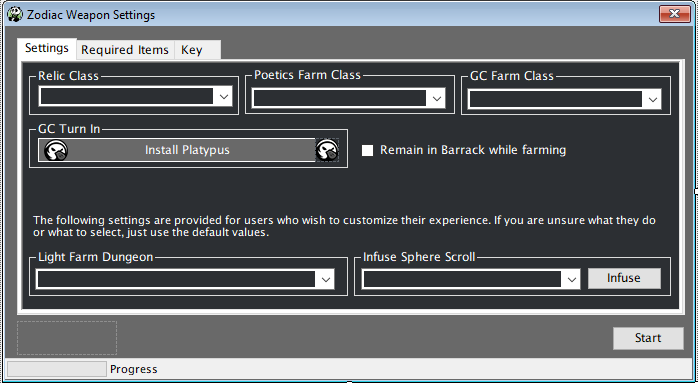

# Zodiac Weapons

[![Discord][3]][4]
[](https://github.com/sponsors/domesticwarlord86)
[![Donate][5]][6]

This plugin is designed to obtain your level 50 Zodiac Weapons with as little interaction from the user as possible. Information on these weapons can be found here: [FFXIV Console Games Wiki](https://ffxiv.consolegameswiki.com/wiki/Zodiac_Weapons)

This plugin updates on restart of RebornBuddy and doesn't need to be added to repoBuddy. However, it can also be installed quickly using the link in repoBuddy's One-Time Downloads section. 
## Requirements

- [RebornBuddy][7] with active license (paid)
- [Lisbeth][9] with active license (paid)
- [LlamaLibrary][10] (free)
- [LlamaUtilities](https://github.com/nt153133/LlamaUtilities) (free)
- [Platypus](https://rbplatypus.com/) (free+)

## Purchasing

You can request a 72 hour trial of any of my plugins by joining our [![Discord][3]][4] and typing `/trial` on the #bot-spam channel.

You can purchase it using this button:
??? tip "Purchase"

     <script async
     src="https://js.stripe.com/v3/buy-button.js">
     </script>

     <stripe-buy-button buy-button-id="buy_btn_1OEdZeFdsj1r46ilj71sBAwL" publishable-key="pk_live_51Mdje9Fdsj1r46ilbr3eeB0vKcThZI0r8J04ZLrPwhcrkTUEjW5168m9xuRYTTkOyAag0rUWqmFhzmEDRcqCUN900038n3jgm8">
     </stripe-buy-button>

## Installation

1. Download the latest version by following the link [here](https://sts.llamamagic.net/ZodiacWeapons/ZodiacWeapons.zip).
2. On the `.zip` file, right click > `Properties` > `Unblock` > `Apply`.
3. Unzip all contents into `RebornBuddy\Plugins\ ` so it looks like this:

```
RebornBuddy
└── Plugins
    └── ZodiacWeapons
        ├── Profiles
        ├── ZodiacWeaponsLoader.cs
        ├── ZodiacWeaponsSettings.cs
        ├── Version.txt
        ├── LlamaAuth.dll
        └── ZodiacWeapons.dll
```

## Current Progress

### Base Zodiac Weapon (iLvl 80)
- [x] A Relic Reborn ^[Manual Step](#required-items)^

### Zenith Zodiac Weapons (iLvl 90)
- [x] Zenith Zodiac Weapons/Quest

### Atma Zodiac Weapons (iLvl 100)
- [x] Atma Zodiac Weapons ^[Known Issue](#known-issues)^

### Animus Zodiac Weapons (iLvl 100)
- [x] Animus Zodiac Weapons ^[Manual Step](#notes)^

### Novus Zodiac Weapons (iLvl 110)
- [x] Novus Zodiac Weapons ^[Manual Step](#notes)^

### Nexus Zodiac Weapons (iLvl 115)
- [x] Nexus Zodiac Weapons/Quest

### Zodiac Braves Weapons (iLvl 125)
- [x] Zodiac Braves Weapons/Quest ^[Required Items](#required-items)^ ^[Manual Step](#notes)^

### Zodiac Zeta Weapons (iLvl 135)
- [x] Zodiac Zeta Weapons/Quest

## Usage

Open settings, choose your class, hit start. 

{.center .xsmall}

### Settings

1. `Relic Class` - This is what classes's relic you are after.
3. `Poetics Farm Class` - At various points in the relic quest you will need to farm Allagan Tomestones of Poetic. The plugin will run `Keeper of the Lake` with a Duty Support squad to get Tomes. It's a level 50 dungeon and can be done on any class.
4. `GC Farm Class` - At various points in the relic quest you will need to farm Greater Company Seals. The plugin will run `The Sirensong Sea` uncapped to get gear to turn in at your grand company for seals. It's a level 50 dungeon and can be done on any class.
5. `GC Turn In` Zodiac Weapons uses RedWine's [Platypus](https://rbplatypus.com/) botbase to handle Expert Turn In at the grandcompany. It has many inventory and quality of life features and I highly recommend it and configuring it. The button in Zodiac Weapon's settings will install Platypus for you if you don't already have it. Clicking on the Platypus icon will load it's settings for quick access. 
2. `Remain in Barrack while farming` - This will have your character go to your Grand Company's Barrack chamber between dungeon runs.
6. `Light Farm Dungeon` This is the dungeon that you will run for light during the Nexus stage of the relic. I personally prefer Ifrit normal, but there are options for other dungeons here.
7. `Infuse Sphere Scroll` During the Novus stage of the relic you will need to infuse your sphere scroll with materia in order to further enhance your relic. You can read about that process [here](https://ffxiv.consolegameswiki.com/wiki/Novus_Zodiac_Weapons/Quest#Star_Light.2C_Star_Bright). This button will take any available materia in your inventory and attach it to the scroll. It's used to make the process much quicker than doing it by hand.

### Required Items
This tab shows you the items that you are required to get manually that the bot cannot get for you. For best results you'll want them in your inventory when you start the bot, but if you don't have them when the bot needs them it will stop and tell you to obtain them.

1. You will need the base relic weapon for Stage 1 of the relic weapon that's different for each class (you can read about them [here](https://ffxiv.consolegameswiki.com/wiki/Zodiac_Weapons/Quest#Part_2:_Class_Weapon)). This item needs to be infused with two specific materia that's different for each class. This tab will show you what you need for the class you've selected in the Relic Class drop down.
2. For the `Zodiac Braves` stage of the quest you need 8 items (you can read about them [here](https://ffxiv.consolegameswiki.com/wiki/Zodiac_Braves_Weapons/Quest#Crafted_Items)). These items are crafted, but their materials are rare and Lisbeth can't gather them automatically. They can be purchased off the Market Board for relatively cheap. You will need one set of 8 items for each class's relic.

### Key
This tab is pretty straight forward. When you purchase the plugin you'll get a key sent to the email used when making the purchase. Take that key, put it in the box, hit `Verify`. That'll enable the plugin. Job done.

## Notes
- During the `Animus` stage there is a Levequest that the bot can't do Someone's in the Doghouse. It requires you to use the `/beckon` command to escort an NPC back to home base. This will need to be done manually. It's only required to be done once per weapon.
- During the `Novus` stage of the relic you will need to infuse your sphere scroll with materia in order to further enhance your relic. You can read about that process [here](https://ffxiv.consolegameswiki.com/wiki/Novus_Zodiac_Weapons/Quest#Star_Light.2C_Star_Bright). This is done to let you customize the stats on your relic weapon, but as these are strictly used for glamour now stats really don't matter. It's best to just get the cheapest materia you can find to get through this stage. Once you've infused the scroll completely, press the start button on the Zodiac Weapons plugin and it'll take it from there.
- During the `Zodiac Braves` step of the quest you will be required to do two dungeons manually. 
    * `Hullbreaker Isle` - ~~ The final boss arena is broken up into multiple small rocks that you have to jump between to attack the boss. RB cannot do this. There's a profile in the Profiles folder of this plugin that will do the dungeon up to the final boss and pause there for you to complete it. ~~ We were able to add the final boss arena into the navigation mesh. It should successfully complete the final boss now. But keep an eye on it.
    * `Stone Vigil (Hard)` - This dungeon is troublesome because of the second boss `Cuca Fera` the giant turtle. The encounter requires you to use the cannons near by to damage him. You also have to kill him before his unstoppable AOE damage kills all the NPCs nearby, as their death will immediately fail the encounter. This encounter is near impossible to do solo on most classes. The only class that can really solo it successfully is Blue Mage. If you have BLU with something like Level 5 Death, you should be able to one shot him. Otherwise, queue this dungeon in a normal group to complete it. It only has to be done once per weapon. 

## Known Issues
- When farming FATEs for the Atma stage of the quest sometimes the bot will get stuck trying to take off between FATEs. Stopping/starting the bot will typically resolve it but you are going to want to monitor the bot during this stage.


[3]: https://img.shields.io/badge/Discord-7389D8?logo=discord&logoColor=ffffff&labelColor=6A7EC2
[4]: https://discord.gg/CucSWEhJSZ "Discord"
[5]: https://shields.io/badge/-Buy%20me%20a%20coffee-FF5E5B?logo=kofi&logoColor=ffffff&labelColor=FF5E5B
[6]: https://ko-fi.com/domesticwarlord86 "Donate via Ko-Fi"
[7]: https://www.rebornbuddy.com/ "RebornBuddy"
[8]: https://github.com/LlamaMagic/ExBuddy "ExBuddy"
[9]: https://www.siune.io/ "Lisbeth"
[10]: https://github.com/nt153133/__LlamaLibrary "LlamaLibrary"
[11]: https://discord.gg/rDsFbKr "Magitek Discord"
[12]: https://github.com/Zimgineering/repoBuddy "RepoBuddy"